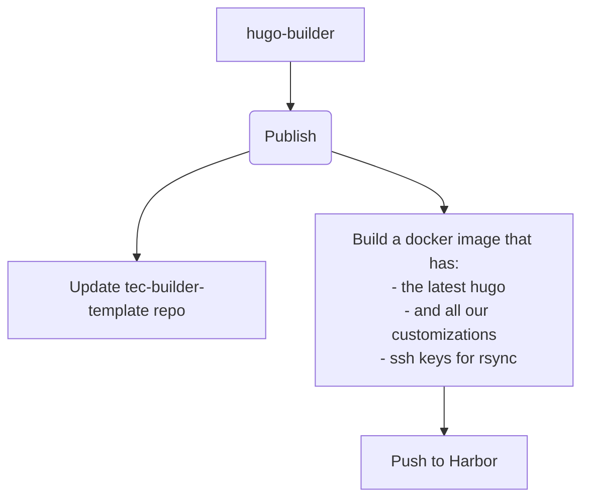
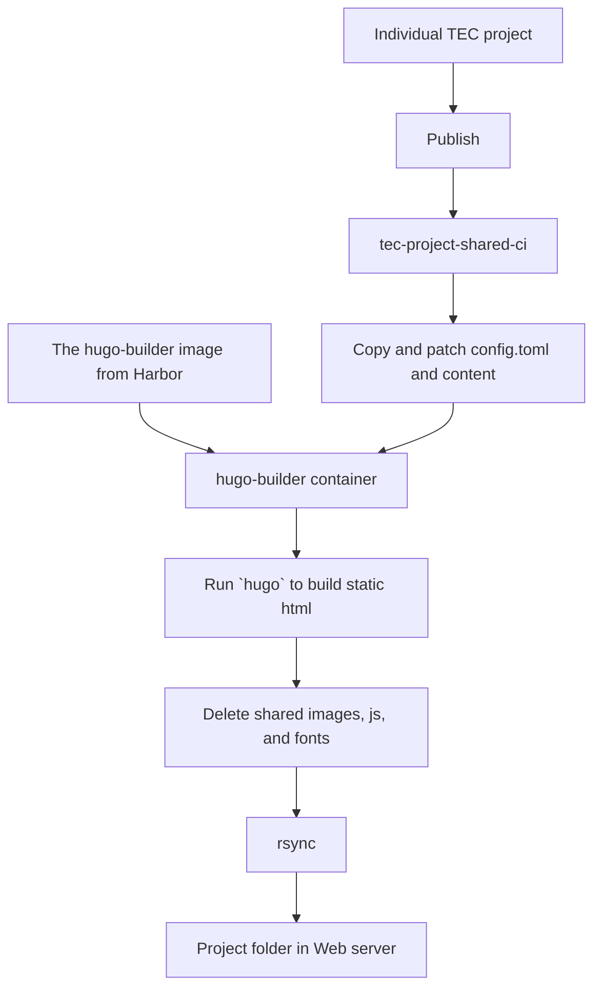
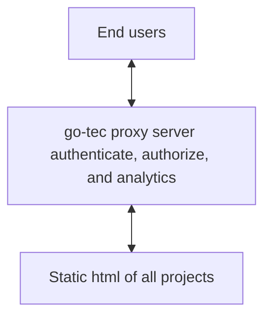

# Project for TEC documents

## For Authors

1. run `hugo server` and open the url to view changes in real time. (It starts with a detailed document.)
1. Edit `config.toml`
1. Create markdown files in `content` folder
1. Publish

## For Admins

1. Use the [create-tec-project](https://svl-devops-gitlab01.fortilab.fortinet.com/tec/create-tec-project) to create a new project.

## Technical details

### Build hugo-builder docker image with CI/CD

### Build individual TEC project with CI/CD

### Serving TEC documents to end users

