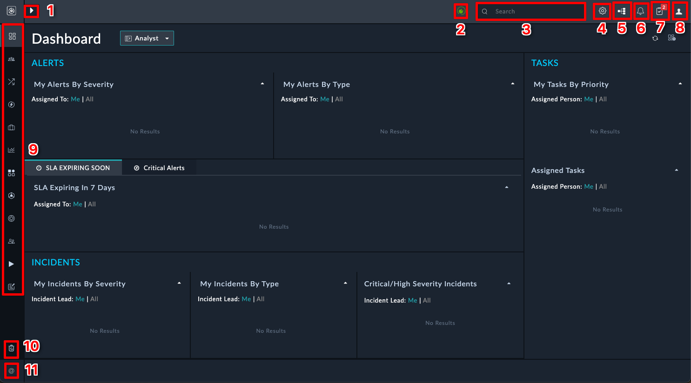
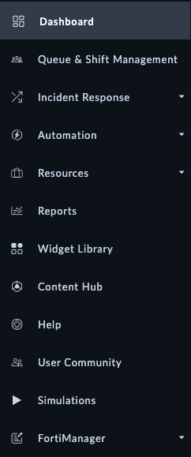

This chapter aims to get you familiar with the FortiSOAR interface and key concepts. If you're new to security orchestration and automation, this guide will help you understand the fundamental components and how they work together.

## What is SOAR?

Before diving into FortiSOAR specifics, it's helpful to understand what SOAR (Security Orchestration, Automation, and Response) is:

SOAR platforms like FortiSOAR help teams automate repetitive tasks, coordinate security tools, and manage incidents more efficiently. This results in faster response times, reduced analyst fatigue, and improved operations.

## Core FortiSOAR Concepts

Below are the essential terms you'll encounter when working with FortiSOAR:

| Term              | Definition                                                                                                                     | Why It Matters                                                                                                                                        |
|-------------------|--------------------------------------------------------------------------------------------------------------------------------|-------------------------------------------------------------------------------------------------------------------------------------------------------|
| Dashboard         | The first page you see when you log in to FortiSOAR. It provides an overview of the system and the modules you have access to. | Gives you a quick snapshot of your security posture and pending work.                                                                                 |
| Module            | A table of data that is used to store information. ie. Incidents, Alerts, Indicators, Tasks, etc.                              | Organizes different types of security data for better management. FortiSOAR lets you customize this to extreme ends, and even build your own modules. |
| Record            | A row in a module. ie. a singular incident, alert, indicator task, or playbook.                                                | Represents a specific item that needs attention or tracking.                                                                                          |
| Scenario          | A special record that is used to simulate an incident or alert.                                                                | Allows you to test playbooks and automation without requiring setup and using real data.                                                              |
| Playbook          | A series of automated tasks that are executed in a specific order.                                                             | Automates repetitive security workflows to increase efficiency.                                                                                       |
| Content Hub       | A repository of connectors and solution packs that can be installed to extend the functionality of FortiSOAR.                  | Allows you to expand capabilities without custom development.                                                                                         |
| Connector         | A tool that allows FortiSOAR to communicate with other security systems.                                                       | Enables integration with your existing security stack.                                                                                                |
| Solution Pack     | A collection of modules, playbooks, scenario Records, dashboards, and reports that are designed to solve a specific use case.  | Provides ready-made automation for common security scenarios.                                                                                         |
| Execution History | A log of all the playbooks that have been executed in FortiSOAR.                                                               | Helps with troubleshooting and compliance documentation.                                                                                              |
| System Settings   | The settings that control the behavior of FortiSOAR.                                                                           | Allows customization of the platform to meet your organization's needs.                                                                               |

## FortiSOAR Interface Navigation

The interface is designed to give you easy access to all the functionality you need. Here are the key elements:

| Number | Picture                                                                            | Name                | Description                                                                                             | Common Uses                                                      |
|--------|------------------------------------------------------------------------------------|---------------------|---------------------------------------------------------------------------------------------------------|------------------------------------------------------------------|
| 1      |                                   | Navigation Expander | Used to expand the left hand navigation menu.                                                           | Toggle the navigation pane when you need more screen space.      |
| 2      |                                             | Live Sync Icon      | Indicates that the information on the screen is updated in real-time.                                   | Verify you're seeing the latest data during active incidents.    |
| 3      |                                                 | Search Bar          | Used as a global search for things in FortiSOAR.                                                        | Quickly find specific incidents, alerts, or indicators.          |
| 4      |                                        | System Settings     | Used to change the system settings of FortiSOAR.                                                        | Configure user permissions, email settings, and integrations.    |
| 5      |                                     | Execution History   | A log of all the playbooks that have been executed in FortiSOAR.                                        | Troubleshoot automation issues or verify actions were taken.     |
| 6      |                                          | Notifications       | Comment mentions or items that require your attention.                                                  | Stay informed about mentions and updates to your assigned items. |
| 7      |                                         | Pending Tasks       | A list of tasks or playbook approvals that are assigned to you and require your attention.              | Quickly access your to-do list and required approvals.           |
| 8      |                                          | User Profile        | Used to change your user settings and log out of FortiSOAR.                                             | Update your preferences and contact information.                 |
| 9      | {}{} | Navigation Menu     | The left hand navigation menu that contains all the modules and pages you have access to in FortiSOAR.  | Access different modules and functionality of the platform.      |
| 10     |                                          | Recycle Bin         | A place where deleted records/playbooks are stored. You can restore deleted items from the recycle bin. | Recover accidentally deleted items.                              |
| 11     |                                          | Version             | The version of FortiSOAR you are currently using.                                                       | Verify your version when troubleshooting or updating.            |

{}
The most commonly used features when demoing are the Navigation Expander (where Content Hub, Alerts, Playbooks are found), Execution History, System Settings, and Scenarios. Familiarize yourself with these to navigate FortiSOAR efficiently.
{}

Take 5-10 minutes clicking around FortiSOAR to get a feel for the interface. You can't break anything, so don't be afraid to explore. :smile:

As a challenge, try to find the following items in the interface:

1. Find the **Incidents** module
    - Create a new incident
2. Find the **Playbooks** section
    - Create a new playbook
3. Find the **Content Hub**
    - Install a connector
    - Uninstall a connector 
4. Find the **System Settings**
    - How would you create a new user?
    - Where would you configure RBAC for users?

Only proceed to the next chapter when you feel comfortable navigating the FortiSOAR interface.
