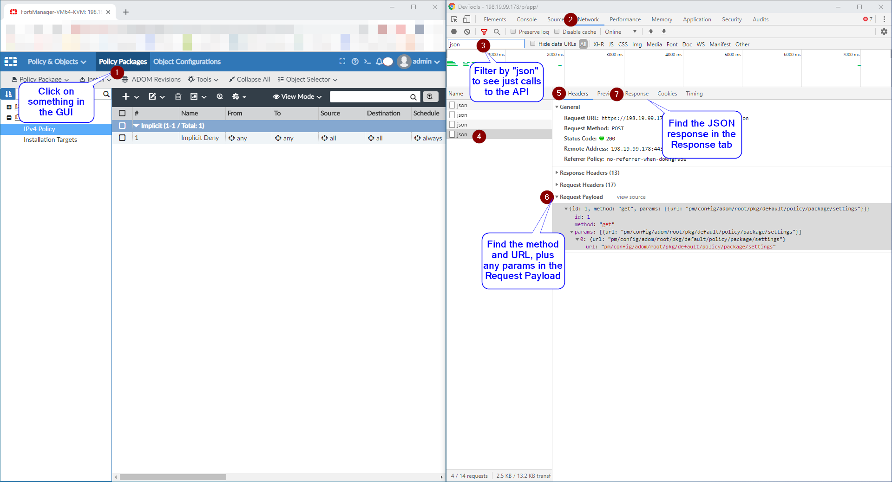

## Introduction

The FortiManager API provides programmatic access to all FortiManager functions, enabling you to automate device management, policy deployment, and configuration tasks. This guide will teach you how to discover API calls, understand their structure, and implement them in your automation workflows.

## Why Use the FortiManager API?

### Common Use Cases

- **Bulk Policy Deployment** - Push firewall policies to multiple devices
- **Device Onboarding** - Automatically configure new FortiGates
- **Compliance Reporting** - Extract configuration data for auditing

---

## Chapter 1: Discovering API Calls with Browser DevTools

The easiest way to understand FortiManager APIs is to watch what happens when you use the web interface. Your browser's Developer Tools can reveal the exact API calls behind every action.

### Method 1: Using Chrome DevTools

**Step-by-Step Process:**

1. **Open Developer Tools**
    - Press `Ctrl + Shift + I` (Windows/Linux) or `Cmd + Option + I` (Mac)
    - Alternatively, press `F12`
    - Or right-click and select "Inspect"

2. **Prepare Network Monitoring**
    - Click on the **Network** tab in DevTools
    - Clear any existing entries by clicking the clear button (🚫)
    - Ensure recording is active (red record button should be pressed)

3. **Execute the Action**
    - In the FortiManager web interface, perform the action you want to replicate
    - Examples: Create a policy, add a device, modify settings

4. **Filter and Analyze**
    - In the DevTools Network tab, type `json` in the filter box
    - This shows only API calls that send/receive JSON data
    - Click on any API call to see details



### What You'll See in DevTools

**Request Headers Section:**

```
Request URL: https://your-fmg.company.com/jsonrpc
Request Method: POST
Content-Type: application/json
```

**Request Payload (Body):**

```json
{
  "method": "get",
  "params": [
    {
      "url": "/pm/config/adom/root/obj/firewall/policy",
      "option": [
        "get meta"
      ]
    }
  ],
  "session": "abc123session456",
  "id": 1
}
```

**Response:**

```json
{
  "result": [
    {
      "status": {
        "code": 0,
        "message": "OK"
      },
      "url": "/pm/config/adom/root/obj/firewall/policy",
      "data": [
        ...
      ]
    }
  ],
  "id": 1
}
```

### Method 2: Use the Fortinet Developer Network (FNDN)



### Method 3: FMG API By Example

This is my favorite method by far. This is an example based API Doc that has examples of API calls with an easily searchable interface.

https://how-to-fortimanager-api.readthedocs.io/en/latest/index.html


---

## Chapter 2: Understanding FortiManager API Structure

### JSON-RPC Format

FortiManager uses JSON-RPC 2.0 protocol for API communication. Every request follows this structure:

```json
{
  "method": "operation_type",
  "params": [
    {
      "url": "/api/endpoint/path",
      "data": {
        object_data
      },
      "option": [
        "additional_options"
      ]
    }
  ],
  "session": "session_token",
  "id": request_id
}
```

### Common Methods

| Method   | Purpose                 | Example Use                                  |
|----------|-------------------------|----------------------------------------------|
| `get`    | Retrieve data           | Get firewall policies, device status         |
| `add`    | Create new objects      | Add address objects, create policies         |
| `set`    | Modify existing objects | Update policy settings, change device config |
| `delete` | Remove objects          | Delete policies, remove devices              |
| `update` | Bulk updates            | Mass policy changes                          |
| `clone`  | Copy objects            | Duplicate policies or objects                |
| `move`   | Reorder items           | Change policy sequence                       |

### URL Structure Patterns

FortiManager API URLs follow predictable patterns:

**Device Management:**

- `/dvmdb/device/{device}/device` - Device operations

**Policy & Objects:**

- `/pm/config/adom/{adom}/obj/firewall/address` - Address objects
- `/pm/config/adom/{adom}/obj/firewall/policy` - Firewall policies
- `/pm/config/adom/{adom}/obj/firewall/service/custom` - Service objects

**System Operations:**

- `/sys/status` - System status
- `/sys/login/user` - User management

### Response Structure

All API responses follow this format:

```json
{
  "result": [
    {
      "status": {
        "code": 0,
        "message": "OK"
      },
      "url": "/pm/config/adom/root/obj/firewall/address",
      "data": [
        {
          "name": "Test-Server",
          "uuid": "550e8400-e29b-41d4-a716-446655440000",
          "type": "ipmask",
          "subnet": [
            "192.168.100.50",
            "255.255.255.255"
          ]
        }
      ]
    }
  ],
  "id": 1
}
```

**Status Codes:**

- `0` - Success
- `-2` - Object already exists
- `-3` - Object does not exist
- `-6` - Invalid url
- `-10` - Data is invalid for selected url
- `-11` - No permission

---

## Chapter 3: Common API Operations

### Getting Firewall Policies

**Request:**

```json
{
  "method": "get",
  "params": [
    {
      "url": "/pm/config/adom/root/pkg/default/firewall/policy"
    }
  ],
  "session": "your-session",
  "id": 1
}
```

### Creating Address Objects

**Request:**

```json
{
  "method": "add",
  "params": [
    {
      "url": "/pm/config/adom/root/obj/firewall/address",
      "data": {
        "name": "WebServer-DMZ",
        "type": "ipmask",
        "subnet": [
          "10.0.100.10",
          "255.255.255.255"
        ],
        "comment": "DMZ Web Server"
      }
    }
  ],
  "session": "your-session",
  "id": 1
}
```

### Bulk Operations: Creating Multiple Objects

**Request:**

```json
{
  "method": "add",
  "params": [
    {
      "url": "/pm/config/adom/root/obj/firewall/address",
      "data": [
        {
          "name": "Server-01",
          "type": "ipmask",
          "subnet": [
            "192.168.10.10",
            "255.255.255.255"
          ]
        },
        {
          "name": "Server-02",
          "type": "ipmask",
          "subnet": [
            "192.168.10.11",
            "255.255.255.255"
          ]
        },
        {
          "name": "Server-03",
          "type": "ipmask",
          "subnet": [
            "192.168.10.12",
            "255.255.255.255"
          ]
        }
      ]
    }
  ],
  "session": "your-session",
  "id": 1
}
```

### Installing Policies to Devices

After creating or modifying policies, install them to devices:

**Request:**

```json
{
  "method": "exec",
  "params": [
    {
      "url": "/securityconsole/install/package",
      "data": {
        "adom": "root",
        "pkg": "default",
        "scope": [
          {
            "name": "FortiGate-01",
            "vdom": "root"
          },
          {
            "name": "FortiGate-02",
            "vdom": "root"
          }
        ]
      }
    }
  ],
  "session": "your-session",
  "id": 1
}
```

# FortiGate API Calls via FortiManager (Proxy Method)

FortiManager maintains established tunnels to FortiGate devices, allowing you to leverage these connections for API calls. This approach offers several advantages:

- **Simplified authentication**: No need to authenticate to each FortiGate individually
- **Bulk operations**: Execute API calls across multiple devices simultaneously
- **Centralized management**: Use FortiManager as a proxy for all FortiGate interactions

## Making Proxy API Calls

To execute API calls through FortiManager, you need to specify the FortiOS API endpoint within the FortiManager request structure.

### Request Structure

| Parameter    | Description                                                |
|--------------|------------------------------------------------------------|
| **target**   | Device or group identifier (e.g., **All_FortiGate** group) |
| **action**   | HTTP method (**get**, **post**, **put**, **delete**)       |
| **resource** | FortiOS API endpoint path                                  |

### Example: Query Admin Account Settings

This example demonstrates querying admin users from all FortiGates in the ADOM using the hidden `All_FortiGate` group:

```json
{
  "id": "1",
  "method": "exec",
  "params": [
    {
      "url": "/sys/proxy/json",
      "data": {
        "target": "adom/root/group/All_FortiGate",
        "action": "get",
        "resource": "/api/v2/cmdb/system/admin?format=name"
      }
    }
  ],
  "verbose": 1,
  "session": "{{session}}"
}
```

This is what the api looked like in FNDN for querying fortigate admin users (/api/v2/cmdb + /system/admin)


Make sure to check out all the options available with /sys/proxy/json [here](https://how-to-fortimanager-api.readthedocs.io/en/latest/016_sys_proxy_json.html)