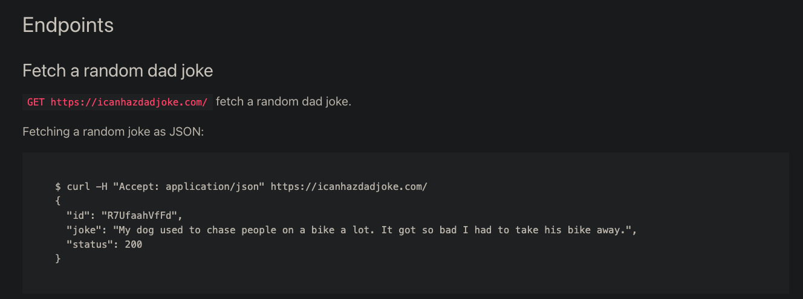
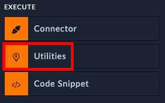
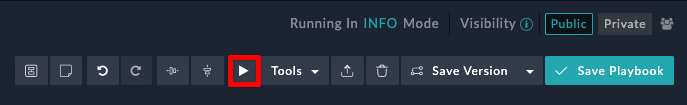
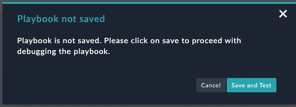
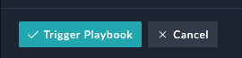
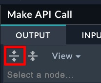

This guide demonstrates how to make generic API calls directly within SOAR playbooks when specific connectors aren't available. We'll use the Dad Joke API as a practical example.

## Dad Joke API Overview

**Base URL:** `https://icanhazdadjoke.com/`

**Key Features:**

- Multiple response formats supported
- Custom User-Agent header recommended

**API Response Formats:**

- `application/json` - JSON response

**Example JSON Response:**

```json
{
  "id": "R7UfaahVfFd",
  "joke": "My dog used to chase people on a bike a lot. It got so bad I had to take his bike away.",
  "status": 200
}
```



## Creating the SOAR Playbook

### Step 1: Set Up Collection and Playbook

1. Navigate to **Automation > Playbooks**
2. Click **+ New Collection**
    - **Name:** "Jokes"
3. Click **Create**
4. Click **+ Add Playbook**
    - **Name:** "Dad Joke Example"
5. Click **Create**

### Step 2: Configure Manual Trigger

You should now see this screen:


1. Select the **Manual** trigger start step
2. Configure the following settings:
    - **Trigger Button Label:** `Get Dad Joke`
    - **Does not require a record Input:** `Yes`
    - **Select Module:** `Alerts`
3. (Optional) Add a custom popup message


### Step 3: Add API Call Step

1. Click and drag from the blue arrows to create a new action step
   
2. Select **Utilities** (under **EXECUTE**)
   
3. Configure the API call:
    - **Step Name:** `Make API Call`
    - **Configuration:** the Utilities connector configuration
    - **Action:** "Utils: Make Rest API Call"
    - **URL:** `https://icanhazdadjoke.com/`
    - **HTTP Method:** `GET`
    - **Headers:** `{"Accept": "application/json"}`
4. Click **Save**

Your step should look like this:


## Testing the Playbook

### Run the Playbook

1. Click the **Play** button (top right)
   
2. Click **Save and Test**
   
3. Click **Trigger Playbook** (bottom left)
   

The execution history will display automatically, showing real-time playbook execution with input/output details for each step.


{}
Step input and output are only recorded when the playbook runs in **DEBUG** mode. In the default **INFO** mode each step shows just its status and execution time, and the expand steps below will show you nothing. Before running, click **Running In INFO Mode** in the designer's top bar, set **Select Execution Log Level** to `DEBUG`, and click **Apply**.
{}

### Review Results

1. **Double-click** the "Make API Call" step to view results
   
2. Click **Expand** to view the complete JSON response
   
   
3. Verify the API call returned the expected joke data structure

### Trigger from Alerts Page

1. Navigate to **Incident Response > Alerts**
2. Select **Execute** and click the drop down item "Get Dad Joke"
   
3. Open the playbook execution history at the top right
   
4. Open the step **Make API Call** results and see what joke you got this time.

Having SOAR make API calls internally is fun and all, but what if you wanted to display the joke with a pop-up, or add the joke to an Alert? Or what if we wanted to schedule this playbook to run twice a day? These concepts and more will be covered in the Playbooks section.

## Takeaways

- Any product with API capability can be integrated into SOAR. No coding experience required
- Playbooks can be turned buttons on any page in SOAR that users can run. End users don't need playbook knowledge to execute automations