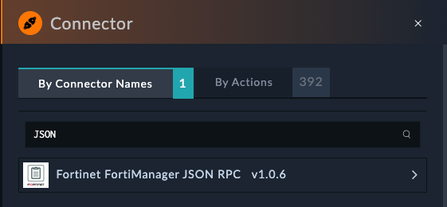
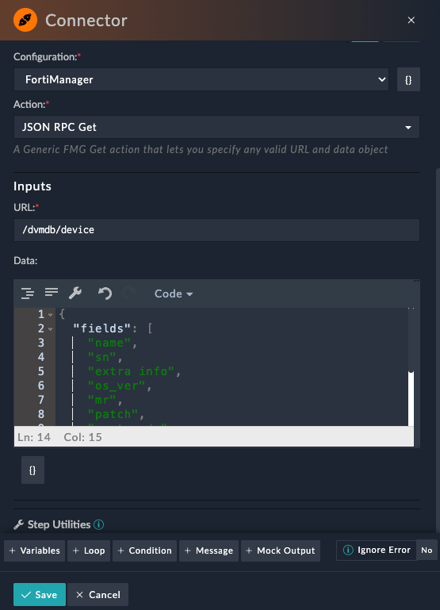
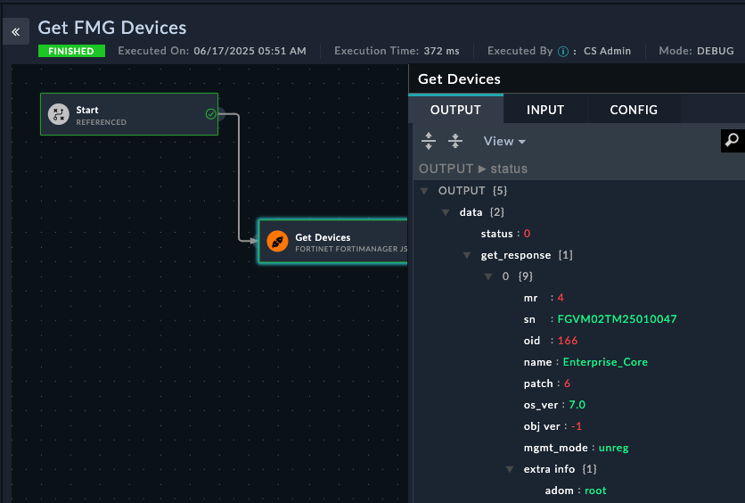
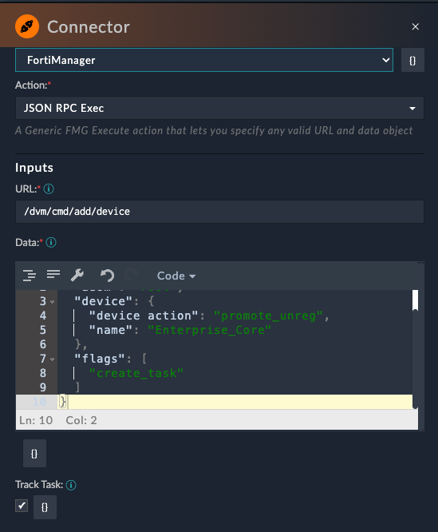
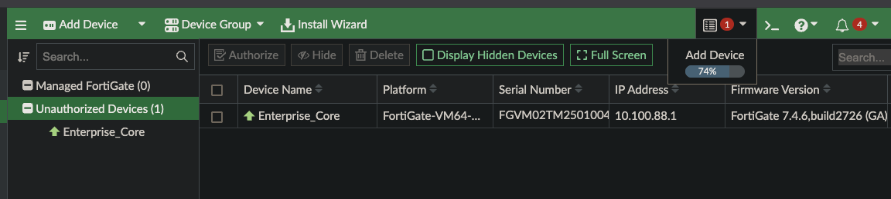
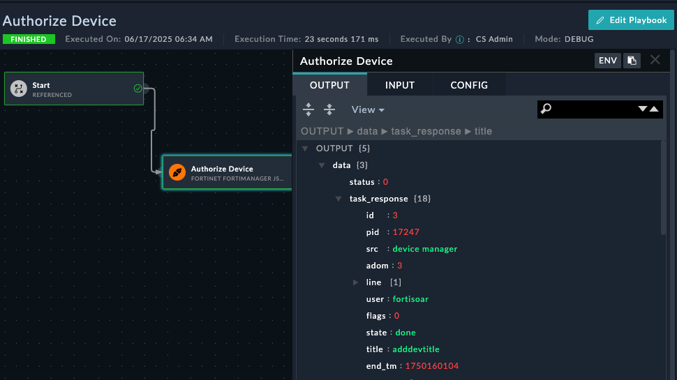
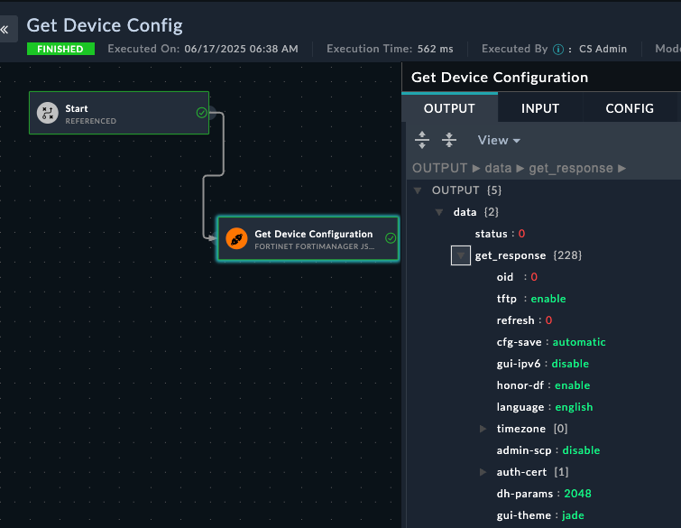

The FortiManager JSON RPC connector was created by myself (Dylan Spille) to better work with the RPC actions that FortiManager supports. In order to use this connector, you do need to have familiarity with FMG API endpoints, and how to format the request data. Make sure you've read the FMG API section before this chapter.

## Prerequisites

The Venn diagram between playbooks, jinja, and API in SOAR is very much like a complete circle, so it's a little challenging to have different chapters but not involve the other sections. If you find yourself stuck, you may want to visit the [Playbooks](/chapter-03-playbooks) chapter and come back to this later.

### Create an API Account on the FortiManager

1. Login to the FortiManager UI (Get IP of the FortiManager VM from your Workshop Dashboard) with the following credentials:
    - Username: `admin`
    - Password: `$3curityFabric`
2. Open the integrated SSH terminal
   
3. Run the following command to create a new API Admin (Use the copy button below)
   ```shell
   config system admin user
       edit "fortisoar"
           set password fortinet
           set profileid "Super_User"
           set avatar "/9j/4AAQSkZJRgABAQAAAQABAAD/2wBDAAMCAgMCAgMDAwMEAwMEBQgFBQQEBQoHBwYIDAoMDAsKCwsNDhIQDQ4RDgsLEBYQERMUFRUVDA8XGBYUGBIUFRT/2wBDAQMEBAUEBQkFBQkUDQsNFBQUFBQUFBQUFBQUFBQUFBQUFBQUFBQUFBQUFBQUFBQUFBQUFBQUFBQUFBQUFBQUFBT/wAARCABAAEADAREAAhEBAxEB/8QAHwAAAQUBAQEBAQEAAAAAAAAAAAECAwQFBgcICQoL/8QAtRAAAgEDAwIEAwUFBAQAAAF9AQIDAAQRBRIhMUEGE1FhByJxFDKBkaEII0KxwRVS0fAkM2JyggkKFhcYGRolJicoKSo0NTY3ODk6Q0RFRkdISUpTVFVWV1hZWmNkZWZnaGlqc3R1dnd4eXqDhIWGh4iJipKTlJWWl5iZmqKjpKWmp6ipqrKztLW2t7i5usLDxMXGx8jJytLT1NXW19jZ2uHi4+Tl5ufo6erx8vP09fb3+Pn6/8QAHwEAAwEBAQEBAQEBAQAAAAAAAAECAwQFBgcICQoL/8QAtREAAgECBAQDBAcFBAQAAQJ3AAECAxEEBSExBhJBUQdhcRMiMoEIFEKRobHBCSMzUvAVYnLRChYkNOEl8RcYGRomJygpKjU2Nzg5OkNERUZHSElKU1RVVldYWVpjZGVmZ2hpanN0dXZ3eHl6goOEhYaHiImKkpOUlZaXmJmaoqOkpaanqKmqsrO0tba3uLm6wsPExcbHyMnK0tPU1dbX2Nna4uPk5ebn6Onq8vP09fb3+Pn6/9oADAMBAAIRAxEAPwD89dO0661e/t7Kyt5Lu8uHEUUEKlnkYnAUAdSTXtHlH01afsBeKNN0+1m8Z+NfBvgG8uUEi6breqot0qkZG5Bkisfarormvs31diT/AIYZs/8AouHw3/8ABp/9al7X+6w9n5oP+GGbP/ouHw3/APBp/wDWo9r/AHWHs/NB/wAMM2f/AEXD4b/+DT/61Htf7rD2fmg/4YZs/wDouHw3/wDBp/8AWo9r/dYez80JJ+wB4k1i2uP+EO8eeCfHGowoZP7M0nVkNzIAMnYjYJo9slurB7N9GfM2s6NfeHdVu9M1O0lsdQtJGhntp0KvG4OCCDW6d9UZbH0Z/wAE9dOtZfj/AC6zcwJcyeHtCv8AWLZJBkedGgCH8C+fwrGt8NjWl8Vz598W+LNV8ceI9Q13WryW/wBTv5mnnnmcszMxyevb2rZJJWRk3fVmRTA634W/DLWfi7420zwtoSI2pai5igMuRHv2kgMwBxnGM1MpKKuxpOTsjG8T+GNV8Ga/faJrdjNpuq2MrQ3FrOu143HUEU001dCatozLpgaGga9qHhfWbPVdLu5rHULOVZoLiByjo6nIII9xSavow2PpH9v+KLU/iN4O8WeRHBf+KPCthql95S7Q9wybXfA9SuaxpaJrsa1N0w/4J7f8lY8Y/wDYmap/KOit8K9Qpbs+Xq3Mj7H/AGRf2OdB8X+DLv4ufF3UToHw108s0UTt5bX5U4J3ddmRt45Y8CuapUafLHc2hBNc0tj2fwd/wUd+GfgPx7pHhz4e/DKz0DwRHKYp9SFsTezoFOPLjQbtzHAG4sTnnFZOjJq8nqaKqk7JaHz34g/ac8MfFb9rqHx38V/CG/wlDvtG0WGACVYtjLG0w4MjKWDHvxgdBWypuMOWL1MnNSneSOk/a1/Y48OaH4FtvjB8GtQ/tz4c3gD3NqjmR7AscZB67MnBDcqevsqdRt8s9ypwVuaOx8Y10mB9Sft1/wCu+Dn/AGIun/8As1YUuvqbVOnoM/4J7f8AJWPGP/Ymap/KOit8K9RUt2fPPgjw4/jDxloWhIxVtSvoLPcOq+Y4XP4ZzWrdlczSu7H3F/wVB8bTeHdT8CfBPw9m10DQ9Lgmks7bhZZTlIlIHXCrnHq+a5qCvebN6ztaKPdP2f8A9n74S/s8fAHwh8Vfip4R/wCEa8WaGGubi7vpJHmEzSERnylbazEbdqkEqfTrWU5ynJxi9DSMYxipSRo/GH4I/Br9qH4I+Nvip8OvCg8UeLNWtD9muLSWSGf7TGQB+6Y7UcY5G3LDrnNKMpwkoyeg5RjOLlE+c/8AgmD44mufGfjD4KeJ4nufDviHT5/M065ziKZBtkAB+6WUkHHdQe1bV1opoyovVxZ8WfEfwq3gX4g+JfDjtvfSdRuLEt6+XIyf0rpi7pMwas7H0D+3X/rvg5/2Iun/APs1ZUuvqa1OnoM/4J7f8lY8Y/8AYmap/KOit8K9RUt2fOXhe51K08SaXNo0skGrpdRm0liOHWbcNhHvnFbPbUyXkfWv7WH7IXxP+GttH8SvGvxH03xJcOsRW61O9db13CgrFGkmS5X0BwAK56dSMvdSNpwkvebPr74Q/Fb4c/tf/s4eF/h38U/HFhrHjPXwyzWltKLe9WeNyyHaBgOABg4w3YGueUZU5OUVobxcZxtJ6l3x34++F37GP7P/AIy+Hvw78b2Gi+NNHtWngtr6UT3j3UhBB2kYZjkcAYUckYFJKVSSlJaDbjTi0mfN/wDwTe+C3jCH44j4q+KLKa08OHRrjVE1qXH2e5MvBw44DL8xZeCMcgVtWkuXlRlSi+bmZ8V/GHxPB41+LHjLxBbArbaprF3eRg9lkmZh+hrqirRSOeTu2z3T9uv/AF3wc/7EXT//AGasqXX1NanT0Gf8E9v+SseMf+xM1T+UdFb4V6ipbs+cvDHiG68JeItN1qyETXun3CXMHnJvQSIcqSO+CAa2aurGSdnc+/vgN+1P4T/an+Ht98IP2gdRVdRupnm0nxNPtj2ysSVUt0R1LELngj5T2rknTdN88DpjNTXLM80+IX/BNf40/DLX4tT8ChPF+nxSCay1fQ7xILiPByrbWZWDe6Fh71arQkrSJdKS2IfB3/BN/wCO3xS1m61TxhHH4YikzLcat4jv1mmkbHdVZnJ6ctge9DrQjohKlN7l74eft0a/+zX8H9U+DU/hbTPElzYXl5ZveXd2ZbUwOSGjCp94ZLnO7BDCk6SnLnuNVHBctj491nUU1bVbu9jtILBJ5GkW1tVIiiBP3VBJOB9a6UYH0v8At1/674Of9iLp/wD7NWNLr6m1Tp6Gb/wT/wBd0/Tf2gV0rUbpLKLxFo97okc8hCqssyDywSemWQD8aKy926FTfvHifxF+HWv/AAs8W6h4d8R6dcabqNnK0TJPGVDgHAdSeqnqCK1jJSV0ZtOLszmaoR6b4F/aY+Kfw1tFtPDnjvW9Ms14FtHdsYx9FOQKzcIy3RSlJbMd43/ad+K3xGtGtPEPj3XNRtGGGt3u2WMj3UYFChFbIHOT3Z5j1rQk3PBXgjW/iH4kstC8Pabc6pqd3IsccFtGXPJxk46AdyeBUtqKuxpN6I+gP2/NQs7f4n+GfCVrdRXs/hHw3Y6LeSwncv2hEzIoPfBOKypbN9zSpvbsfMsE8ltMksTtFKjBldDgqR0INbmR9HeHf+CgPxb0bSLbTtQu9H8VQ2yhIZPEGmJcyqoGAN/DHHuTWDox6GqqSNP/AIeJfEX/AKFrwN/4IR/8XR7GPdh7Rh/w8S+Iv/QteBv/AAQj/wCLo9jHuw9ow/4eJfEX/oWvA3/ghH/xdHsY92HtGH/DxL4i/wDQteBv/BCP/i6PYx7sPaMo61/wUI+LmoabcWelz6J4VFwpSSfQdKjt5iD1w53EfUYNHsY9Q9pI+b7y8n1C7murqZ7i5mcySSysWZ2JySSepNbGR//Z"
           set rpc-permit read-write
       next
   end
   ```

## Setup FMG JSON RPC Connector

1. In FortiSOAR, navigate to Content Hub > Connectors.
2. Search for `FortiManager JSON RPC`
3. Open the connector.
4. Configure the connector
    - **Name**: `FortiManager`
    - **Hostname**: `10.100.88.10`
    - **Username** `fortisoar`
    - **Password** `fortinet`
    - **Verify SSL**: False
5. Make sure the health check passes
   

## Register Enterprise Core to FMG

1. Login to Enterprise_Core Fortigate. Follow the steps outlined [here](/chapter-05-ztp/06-page-onboard-fortigate) to register the fortigate to fortimanager.
2. Don't authorize the device to FMG yet. We'll do that from SOAR

## Basic Queries

### Get list of device in SOAR

1. Navigate to **Automation > Playbooks**
2. Create a new collection called `00 - FMG API`
3. Create a new playbook called `Get FMG Devices`
4. Choose the _Referenced_ Trigger step
5. Drag a new step and pick **Connector**
6. Search for `JSON RPC` and select the Fortimanager Connector
   
7. Provide the Follow details
    - Step Name: `Get Devices`
      **Action** : JSON RPC Get
    - **URL**:`/dvmdb/device`
    - **Data**:
    ```json
    {
      "fields": [
        "name",
        "sn",
        "extra info",
        "os_ver",
        "mr",
        "patch",
        "mgmt_mode"
      ],
      "option": [
        "extra info"
      ],
      "loadsub": 0
    }
    ```
   Your step should look like this
   
8. Save the Step
9. Click **Save Playbook**
10. Click the Play button 
11. Click **Trigger Playbook**
12. Once the Executed Playbook Logs opens, click the step **Get Devices**. Expand the output data and you will see the json responses from the api call
    
    {}
    Important things to see in the API Output are the **name**, **sn**, and **mgmt_mode** values. mgmt_mode is `unreg` because we have not authorized the device yet
    {}

## Authorize a Device

Now that we can see unregistered devices, let's create a playbook to authorize them to FortiManager.

### Create Device Authorization Playbook

1. Create a new playbook called `Authorize FMG Device`
2. Add a JSON RPC connector step:
    - **Step Name**: `Authorize Device`
    - **Action**: JSON RPC Exec
    - **URL**: `/dvm/cmd/add/device`
    - **Data**:
   ```json
   {
     "adom": "root",
     "device": {
       "device action": "promote_unreg",
       "name": "Enterprise_Core"
     },
     "flags": [
       "create_task"
     ]
   }
   ```
    - **Track Task**: True
   
   Your step should look like this
   
3. Save the Playbook
4. Run/Trigger the playbook
5. If you switch to the FMG soon enough, you will see the add device task running
   
6. If successfully added, you will see this json output in SOAR
   

## Get Configuration from FMG CMDB

### Retrieve Device Configuration

1. Create a new playbook called `Get Device Config`
2. Add JSON RPC connector step:
    - **Step Name**: `Get Device Configuration`
    - **Action**: JSON RPC Get
    - **URL**: `/pm/config/device/Enterprise_Core/vdom/root/system/global`
    - **Data**:
   ```json
   {
     "option": ["get meta"]
   }
   ```
3. Save/Trigger the playbook.
   Your step output should look like this
   
   

## Additional use cases

Additional cases will be added depending on time, such as:

- Gettign config directly from Fortigate with sys/proxy/json
- Changing config directly with sys/proxy/json
- Changing device config on FMG DB
- Kick off a device install
- Create firewall objects
- Create and run a simple CLI script

