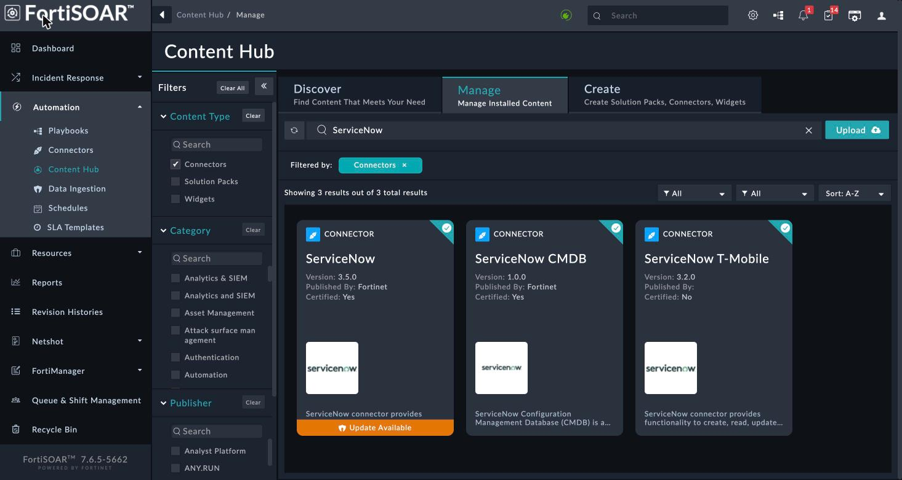
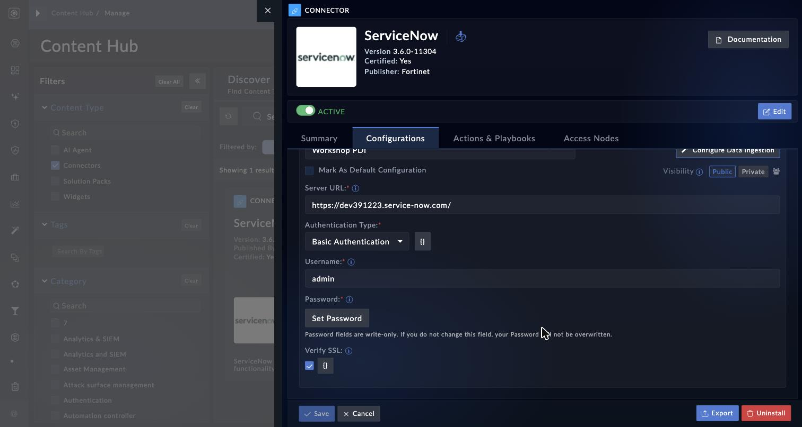
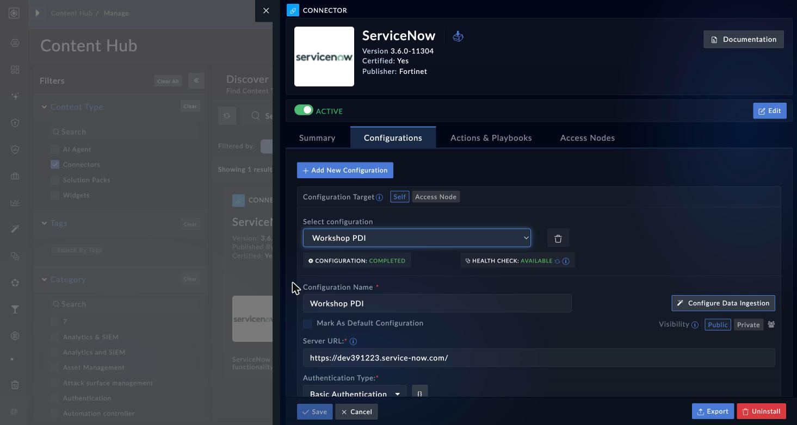

Almost every NOC and SOC workflow ends the same way: something happened, and somebody needs a
ticket. In this lab you connect FortiSOAR to ServiceNow and prove the connection works.

{}
**Which FortiSOAR version are you on?** Look at the bottom of the left navigation pane -- the
version is printed there. This workshop is written for **7.6.5**, and calls out **8.0**
differences where they exist. The two versions rename some menus but behave the same underneath:

| | 7.6.5 | 8.0 |
|---|---|---|
| Connector menus live under | **Automation** | **Orchestration** |
| Content Hub | `Automation > Content Hub` | top-level **Content Hub** |
| ServiceNow connector version | 3.5.0 | 3.6.0 |
| 4th connector tab | **Agents** | **Access Nodes** |
| Configuration Target options | Self / **Agent** | Self / **Access Node** |

Only the names differ. Every configuration field, action name, and parameter in this lab is
**identical on both versions** -- verified on a live appliance of each.
{}

This is a **dependency**, not a detour -- the alert-to-remediation use case you build later closes
its loop by opening a ServiceNow incident using exactly the configuration you create here.

## What you need

| Item | Where it comes from |
|---|---|
| A ServiceNow instance URL | Your instructor -- looks like `https://<your-instance>.service-now.com/` |
| A ServiceNow username | Your instructor (the lab uses an admin-level account) |
| That user's password | Your instructor |
| FortiSOAR access | Chapter 1 |

{}
**If your ServiceNow instance is a Personal Developer Instance (PDI), wake it up first.**
PDIs hibernate after about ten days of inactivity. A hibernating instance fails the FortiSOAR
health check with a connection error that looks exactly like a typo in your configuration -- you
can lose twenty minutes debugging FortiSOAR when the real problem is that ServiceNow is asleep.
Open the instance URL in a browser and confirm you get a login page **before** you touch FortiSOAR.
{}

## Step 1: Confirm ServiceNow is reachable

1. Open your instance URL in a new browser tab.
2. Log in with the credentials your instructor gave you.
3. Leave this tab open -- you will come back to it to confirm your tickets actually arrived.

{}
Do this from the same machine you use for FortiSOAR. If the browser cannot reach ServiceNow,
FortiSOAR will not be able to either, and you have just saved yourself the whole lab's debugging.
{}

## Step 2: Find the ServiceNow connector

The ServiceNow connector ships with the platform, so there is nothing to install -- you only need
to configure it.

1. Expand the left navigation pane, then:
   - **On 7.6.5:** go to **Automation > Content Hub**.
   - **On 8.0:** go to **Content Hub** (it sits at the top level; the automation menus were
     renamed to **Orchestration**).
2. Select the **Manage** tab ("Manage Installed Content").
3. In the **Content Type** filter on the left, tick **Connectors**.
4. In the search box, type `ServiceNow`.
5. Click the **ServiceNow** card to open it.



{}
The search returns more than one result. Pick the plain **ServiceNow** connector -- not
*ServiceNow CMDB* (a different product area) and not *ServiceNow T-Mobile* (an uncertified
customer-specific variant). Check the tile says **Published By: Fortinet** and
**Certified: Yes**.
{}

You should see the connector is **ACTIVE**, published by Fortinet, and certified.

{}
If the tile shows an orange **Update Available** ribbon, leave it alone. Everything in this
workshop works on the version already installed, and upgrading a connector mid-lab can change
field names underneath you.
{}

## Step 3: Create a configuration

A *connector* is the code. A *configuration* is one set of credentials pointing at one system --
you can have several, which is how one FortiSOAR talks to dev and production ServiceNow at once.

1. Open the **Configurations** tab.
2. Click **+ Add New Configuration**.
3. Leave **Configuration Target** set to **Self**. (The other option -- *Agent* on 7.6.5,
   *Access Node* on 8.0 -- runs the connector on a remote collector instead of on FortiSOAR
   itself. Not used in this lab.)
4. Fill in the fields:

   | Field | Value |
   |---|---|
   | **Configuration Name** | `Workshop` (any label you will recognise) |
   | **Server URL** | `https://<your-instance>.service-now.com/` |
   | **Authentication Type** | `Basic Authentication` |
   | **Username** | the account from your instructor |
   | **Password** | click **Set Password**, then enter it |
   | **Verify SSL** | leave ticked |

{}
**The Username and Password fields do not exist until you choose an authentication type.**
They are revealed by your **Authentication Type** selection. If you are staring at the form
wondering where to put credentials, select **Basic Authentication** first and they will appear.
{}

5. Click **Save**.



*(This screenshot and the next are from 8.0. On 7.6.5 the form has the same fields in the same
order -- only the tab and target labels differ, as listed at the top of this page.)*

{}
Notice the hint under the password field: *"Password fields are write-only. If you do not change
this field, your Password will not be overwritten."* FortiSOAR never shows you a stored secret
again. When you edit this configuration later, leaving the password alone keeps the existing one --
it does not blank it out.
{}

### Verify

After saving, look at the two status chips above the form:

- **CONFIGURATION: COMPLETED** -- all required fields are filled in.
- **HEALTH CHECK: AVAILABLE** -- FortiSOAR successfully authenticated against ServiceNow.



{}
These two chips mean different things, and the difference matters. **COMPLETED** only says the
form is filled in -- it will go green even if your password is wrong. **AVAILABLE** is the one that
proves FortiSOAR actually reached ServiceNow and authenticated. Always read the second chip.
{}

If the health check says **DISCONNECTED**, jump to [Troubleshooting](#troubleshooting) below.

## Step 4: Look at what the connector can do

Open the **Actions & Playbooks** tab. This lists every operation the connector exposes -- creating
and updating incidents, change requests, tasks, attachments, and running generalized queries
against any ServiceNow table.

Two things to notice:

1. **There is no "run" button here.** This tab documents the actions; it does not execute them.
   Connector actions run from **playbooks**, which you will build in the next chapter. Opening a
   ticket from FortiSOAR for real is your first playbook's job.
2. **Some actions need the SIR module.** The *security incident* actions require the Security
   Incident Response plugin in ServiceNow. If your lab instance does not have it, use the plain
   **incident** table actions instead -- everything in this workshop does.

### The one parameter that trips everyone up

When you get to the playbook chapter and add a **Create Table Record** step, it takes two
parameters:

| Parameter | What goes in it |
|---|---|
| **Table Name** | `incident` |
| **Record information** | a JSON object holding **all** the field values |

The whole record goes into that single **Record information** field as JSON:

```json
{
  "short_description": "High CPU on core switch",
  "description": "Detected by FortiSOAR automation.",
  "urgency": "3",
  "category": "network"
}
```

{}
This is the single most common mistake with this connector. There is **no** separate
"Short Description" parameter -- everything goes inside **Record information** as JSON. If you
leave it empty, the error you get back names the field by its display label and reads:

`Invalid params provided :: Parameters Record information have either blank value or not provided`

which is easy to misread as "some parameter somewhere is blank." It means: put your JSON in
**Record information**.
{}

Also worth knowing for later: the **Update** action does the same job with differently-named
parameters -- it takes **Sys ID** plus an **Other Fields** JSON blob rather than *Record
information*. Same idea, different label. The `sys_id` you need comes back in the response from
the create action, which is how you chain "open a ticket" to "update that ticket" in one playbook.

## Troubleshooting

| Symptom | Most likely cause | Fix |
|---|---|---|
| Health check **DISCONNECTED**, message about the server URL | Instance is hibernating (PDI) | Open the instance in a browser and wake it, then re-run the health check |
| Health check **DISCONNECTED**, authentication error | Wrong password, or it was rotated | Re-enter it with **Set Password**. On a PDI the password can be reset from the developer portal |
| Health check **DISCONNECTED**, certificate error | Instance uses a certificate FortiSOAR does not trust | Untick **Verify SSL** *for lab use only* -- never in production |
| Configuration shows **COMPLETED** but nothing works | You read the wrong chip | **COMPLETED** only means the form is filled in; check **HEALTH CHECK** |
| Cannot find Username/Password fields | Authentication Type not selected yet | Choose **Basic Authentication** -- the fields are revealed by that choice |

## Challenges

1. Add a **second** configuration pointing at the same instance but with a deliberately wrong
   password. What does the health check say? Which chip changes, and which one does not?
2. In the **Actions & Playbooks** tab, find the action you would use to *search* ServiceNow for
   existing tickets rather than create one. What would you use it for in an alert workflow?
3. Look at the **Configure Data Ingestion** button on the Configurations tab. Without clicking
   through it, what do you think it does, and how is that different from the actions you just
   reviewed?
