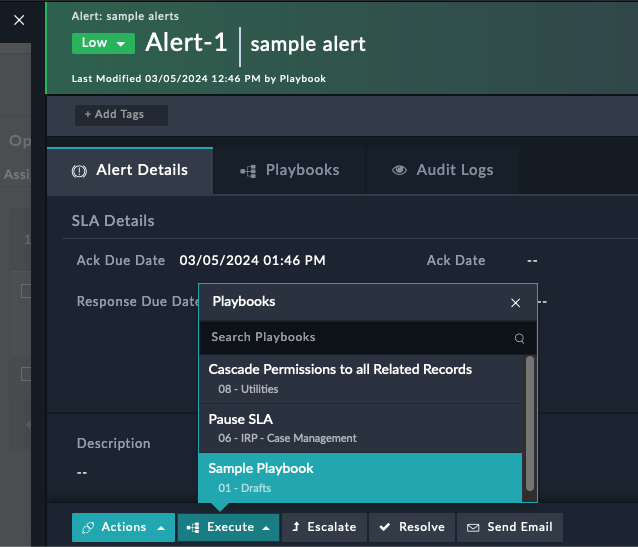
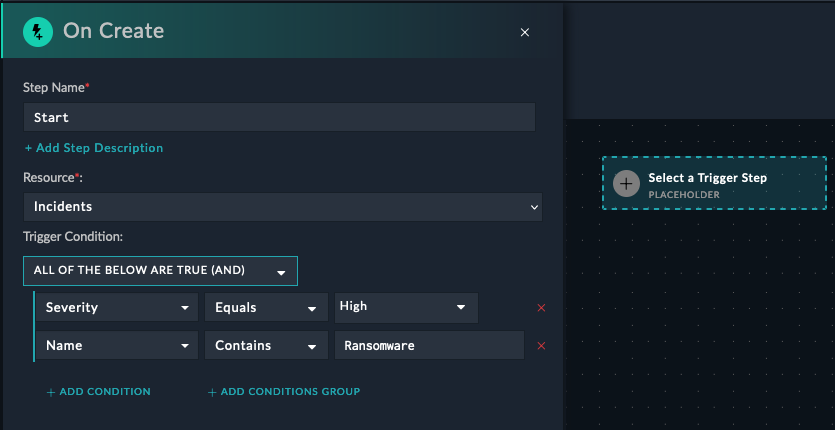
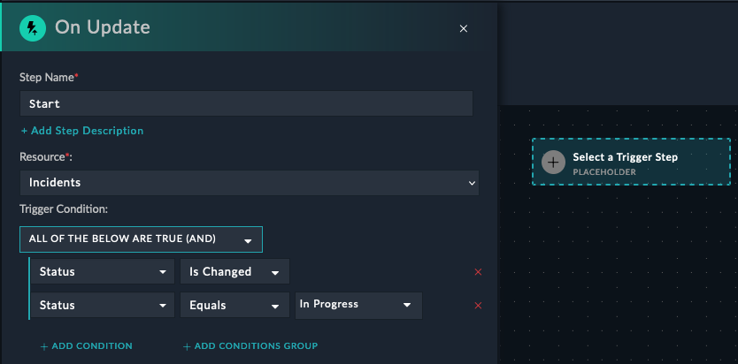
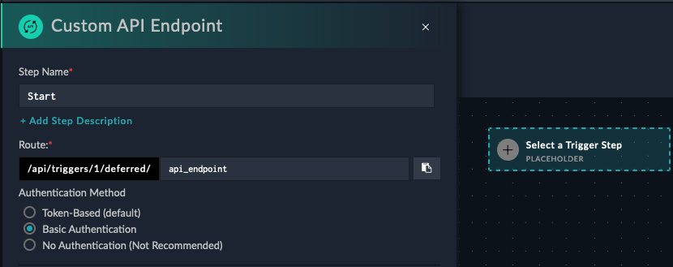

Playbooks can be triggered by a variety of events, such as a new incident being created, the severity of an alert changing, or even via webhook from an external tool. These events are called triggers.


## Types of Triggers

### Manual Trigger

A manual trigger playbooks means that you want the playbook to only be started manually by a user. These playbooks will be accessible by clicking a button in the FortiSOAR UI on some record.


{}
Notice from the image the **Trigger Button Label** and the selection of **Alerts** module. This means that the manual trigger will only be available on the Alerts module.
{}

After creating a manual playbook and telling FortiSOAR what module to display it in, you can run the playbook by clicking the **Execute** button and selecting the playbook you want to run


{}
You can have any number of manual triggers on any module, and you can also have multiple manual triggers on the same module.
{}

### On-Create Trigger

An on-create trigger playbook means that the playbook will be started automatically when a new record is created in the module you specify. This is useful for creating a playbook that will run when a new incident is created, for example. You can also specify a filter to only run the playbook when certain conditions are met. For example, a playbook that filter for incidents with a severity of "High", and the name of the incident contains "Ransomware".


{}
There is no limit to the number of on-create triggers you can have on a module
{}

Typically, organizations will have different playbooks that run for different types of incidents. 

### On-Update Trigger

An on-update trigger playbook means that the playbook will be started automatically when a record in the module you specify is updated/changed. This is useful for creating a playbook that will run when the severity of an incident changes, for example. You can also specify a filter to only run the playbook when certain conditions are met. For example, a playbook could trigger when the status of an incident changes to "In Progress", so that FortiSOAR could automatically update the MTTA (Mean Time to Acknowledge) field in the incident record.


{}
This trigger will only run when the status has changed AND changed to "In Progress". 
{}

### Reference Trigger

A reference trigger is used to signify that you want this playbook to be activated **from** another playbook. This is used to abstract out common functionality into a separate playbook, and then call that playbook from other playbooks. This is useful for creating a playbook that will run when a new incident is created, for example.

### Custom API Endpoint Trigger

A custom API trigger allows you to create an API endpoint to enable external systems to trigger playbooks. Tools like Servicenow or Jira can be configured to call this API endpoint when certain events occur, and then FortiSOAR will run the playbook you specify. 




{}
```bash
curl  -X POST -u 'username:password' https://<FortiSOAR>/api/triggers/1/deferred/api_endpoint
``` 
{}
{}
```python
import requests
requests.post('https://<FortiSOAR>/api/triggers/1/deferred/api_endpoint', auth=('username', 'password') )
```
{}
