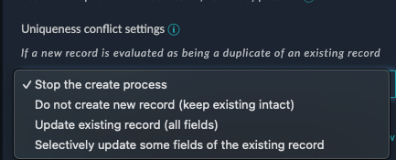
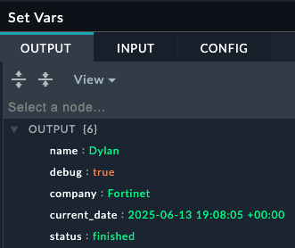

Actions are the building blocks of playbooks. They are the individual steps that connect together after the trigger to form a playbook. There are many different types of actions, and they can be used to perform a wide variety of tasks such as but not limited to, sending an email, creating a ticket in a ticketing system, creating and updating FortiSOAR records, or even running a script on a remote server.



## Core Actions

Core actions are used to do things like creating, updating, and searching for records in SOAR. You can also create variables and use them in other actions within the same playbook

### Create Record

The Create Record action lets you add new entries to any module in SOAR, such as alerts, incidents, or assets. This is commonly used when you receive alerts from external security tools and need to create corresponding records in SOAR for tracking and investigation.

What makes this action powerful is its built-in intelligence for handling duplicate records. You can specify which fields should be unique - for example, ensuring you don't create multiple alerts for the same IP address or incident.

When SOAR detects that a new record would duplicate an existing one based on your uniqueness rules, you have several options for how to handle the situation. Instead of creating a duplicate record, you can choose to update the existing record with new information, skip the creation entirely, or take other custom actions. This prevents your system from being cluttered with duplicate entries while ensuring important information isn't lost.

For instance, if your playbook tries to create an alert for IP address 192.168.1.100 but an alert for that IP already exists, SOAR can automatically update the existing alert with any new details rather than creating a second alert for the same IP address.

### Update Record

Update any record in SOAR. In order to upgrade records, you need to know the record's "IRI" which is a unique identified. An example of this would be a step that changes an alerts status from New to In progress automatically after the playbook looks up information. Often used as an "enriching" step.

### Find Records

Use the Find Records step to find a record in a module within FortiSOAR, using a query or search criteria. You can build nested queries and use any field to search for records

### Set Variable

Oftentimes you want to save specific information from a step, or have a dedicated step to use as a midpoint before another step in order to do data transformation or extraction. Set variables are also used to "see" what the data looked like at particular point in the playbook.

_Before_

_After_

## Evaluate Actions

Evaluate actions are used to make decisions, gather input from analysts, or halt a playbook. They can be used to check if a condition is true or false and then take different actions based on the result.

### Decision Step

This step lets you use Jinja to use simple or complex logic to "route" which path the playbook takes. For example, If Severity is "Low", take the left path, or if it's "High", take the right path, else take the middle



### Manual Input

This step lets you build an input form in case you need a user to provide information to a playbook, or use it to simply have two buttons which could have the playbook take either Path A or Path B depending on the button.

## Execute Steps

Execute actions let you use any of the configured **Connectors** to perform actions on external systems. **Utilities** is a special connector that has common utility-like actions. The **Code Snippet** connector allows you to write and execute raw Python code.

### Connectors

FortiSOAR has prebuilt connectors to various tools and products, all you need to do is provide credentials to get access to them. Afterwards you can use the visual editor to pick which action you want on the step

Here's an example of using the FortiGate connector to create an address objects

### Code Snippet

Code snippet is a special connector that lets you run python code from a playbook. Here is an example of using python to break up an ip address into octets. The first picture shows the playbook editor step, and the second shows what is printed from the playbook execution history
 ----> 

## Reference Actions

Reference a Playbook lets you execute another playbook from within the current playbook. This is useful for reusing common tasks across multiple playbooks. In that context, the playbook being called is often referred to a child playbook, and the playbook calling it is referred to as the parent playbook. The child playbook returns the last step results up to the parent playbook, that way you can use the data returned.  
