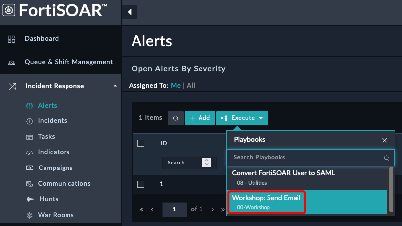

Now that we've covered the playbook basics, let's get hands-on with building a couple of playbooks.

### Create a new playbook collection and playbook

1. On the left pane Select **Automation > Playbooks**
   
2. Click the **+ New Collection** Button and enter
    - **Name**: `00-Workshop`
    - **Description**: `Workshop Playbooks`
3. Click **Create**
   
4. Click the **+ New Playbook** Button and enter
    - **Name**: `01-Send Email`
    - **Description**: `Send an email to a yourself from an alert`
      
5. Click **Create**
6. Select the **Manual** Trigger start step and enter
    - **Trigger Button Label**: `Workshop: Send Email`
    - **Select Module** Dropdown: `Alerts`
    - **Does not require a record Input** Radio: `Yes`
      
   
   {}
   Selecting **does not require a record** means that we don't need to have an alert to start the playbook. This is useful for testing and for playbooks that don't need to be tied to an alert.
   {}

7. Click **Save**
8. Click and hold the blue glowing arrows and drag your mouse out and let go to create a new action step. This will pop up the list of steps we can choose next

    

9. Select the **Send Email** action, towards the bottom left of the page
10. Fill in the fields
    - **Step Name**: `Send Email`
    - **Action**: `Send Email`
    - **To**: **<<your email address>>**
    - **Body**: `This is a test email from FortiSOAR`
    - **Subject**: `Test Email`
  {}
  When sending an email to Fortinet email address in the To field, it's recommended to also add a personal email address. This precaution is recommended to ensure any email inspection doesn't block the request
  {}

11. Click **Save**
12. Click **Save Playbook** at the top right of the page
13. Click the **play** button (Looks like a right arrow) at the top right of the page
    
14. Click the **Trigger Playbook** button at the bottom left of the page. You should see the execution of the playbook pop up after this
    

You have now created and triggered your first playbook. You should receive an email shortly.

{}
You can click on the step output to see the details of the step. This is useful for debugging and understanding what is happening in the playbook.

{}

### Trigger playbook from a button

1. Navigate to **Incident Response > Alerts**
2. Click the **Execute** button and select **Workshop: Send Email**
   

You will see a popup showing the playbook executed. You should receive another email shortly.

### Challenges

{}
Reach out to the instructor if you need help with the challenges.
{}

#### Challenge 1

Create a playbook that triggers when an incident is created AND the severity is critical AND the type is **Lateral Movement**. The playbook should email an address of your choosing.

#### Challenge 2

Create a manual trigger playbook that prompts the user for an IP address and then blocks the IP address on a FortiGate.

#### Challenge 3

Create a playbook that adds the text `Alert has been Closed` to the description field of an alert when the status is updated to `Closed`. 

