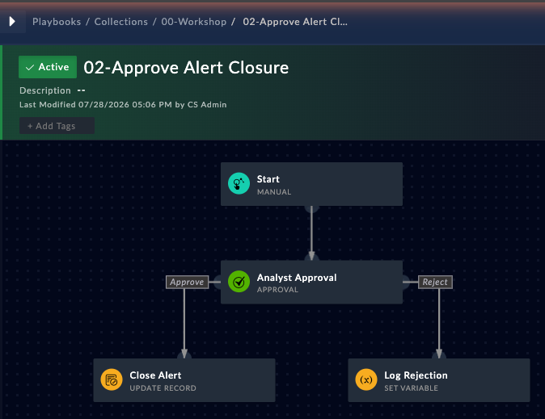

So far you've built playbooks that run straight through from trigger to end. Production playbooks need two more things:

1. **A gatekeeper** -- pause and wait for a human to approve or reject before taking action
2. **Error handling** -- keep running when a step fails, and retry transient failures

This chapter covers both, and you'll build a working approval playbook at the end.

### Prerequisites

- Completed the [Hands-on playbook exercises](/chapter-03-playbooks/04-hands-on)
- At least one alert in the **Alerts** module to run the playbook against

---

## The three "ask a human" steps

Under **EVALUATE** in the step picker there are three steps that pause a playbook and wait for a person:

| Step             | Use it when                                                                                   |
|------------------|-----------------------------------------------------------------------------------------------|
| **Approval**     | You need a formal approve/reject decision, optionally owned by a team, with a timeout         |
| **Manual Input** | You need the analyst to *fill in data* (an IP, a reason, a dropdown choice) before continuing |
| **Manual Task**  | You need someone to go do something outside FortiSOAR and mark it done                        |

{} **Approval is its own step type.** You do not build an approval by adding a Manual Input and flipping a setting -- pick **Approval** from the step list and you get the approve/reject responses, team assignment, and escalation out of the box.
{}

---

## Anatomy of the Approval step

When you add an **Approval** step, the editor has four collapsible sections plus the step name.

### 1. Assignee

The top section controls **who can answer the prompt**:

| Option                   | Behaviour                                            |
|--------------------------|------------------------------------------------------|
| **Specific Users**       | Only the listed users see and can action the prompt  |
| **Specific Team**        | Any member of the selected team can action it        |
| **No specific assignee** | Anyone with permission on the playbook can action it |

The dropdown next to **Specific Team** lists the teams that exist on the appliance -- you pick the team from the list, you don't type a name or an ID.

### 2. Input Prompt Design

This is the prompt the approver actually reads.

| Field           | Notes                                                                                                                             |
|-----------------|-----------------------------------------------------------------------------------------------------------------------------------|
| **Title**       | The heading on the prompt, e.g. `Close this alert?`                                                                               |
| **Description** | A markdown editor with **Write** and **Preview** tabs. Jinja is evaluated here, so you can pull values off the triggering record. |

### 3. Response Mapping

The **Approve** and **Reject** responses already exist -- you don't add them. For each one you pick which step runs next, and one of them is flagged **Primary** (the highlighted button on the prompt).

**Customize Playbook Resumed Message** sets the text shown after someone answers. It defaults to `Awaiting Playbook resumed successfully.`

### 4. Escalation

Answers the question *"what if nobody responds?"*

Set **Do you wish to configure time-based escalations?** to **Yes** and you get:

- **If the decision is not provided within** `[N]` `[Minute(s) / Hour(s) / Day(s)]`
- **Then the following step will be run:** -- you explicitly choose the escalation step

If you leave this at **No**, the playbook waits indefinitely.

---

## Error handling: the Step Utilities bar

Error handling isn't in the body of the step form -- it's the bar along the bottom of the step editor.


Two of these matter for error handling:

### Ignore Error

The **Ignore Error** toggle on the right defaults to **No**. Flip it to **Yes** and the step can fail without failing the whole playbook -- execution carries on to the next step.

Use it for non-essential steps: notifications, logging, best-effort enrichment.

### Loop → do until (retries)

Click **+ Loop** and change the loop type from `for each` to `do until` to turn the step into a retry loop:


| Field               | Notes                                                                                                                                                                    |
|---------------------|--------------------------------------------------------------------------------------------------------------------------------------------------------------------------|
| **Condition**       | The placeholder says **"Expression without `{{ }}`"** -- write the bare expression, e.g. `vars.result.status_code == 200`, **not** `{{ vars.result.status_code == 200 }}` |
| **Retries**         | How many attempts. Default `3`                                                                                                                                           |
| **Delay (seconds)** | Wait between attempts. Default `5`                                                                                                                                       |

{}
The braces are the most common mistake here. Every other Jinja field in the designer wants `{{ ... }}`; the **Condition** boxes under Loop and Condition do not. Wrapping it in braces makes the expression evaluate as a non-empty string, which is always truthy, so the loop exits after one pass.
{}

{}
Combine the two: set a `do until` loop **and** turn on **Ignore Error**, so that a step which never succeeds lets the playbook continue instead of faulting.
{}

---

## Hands-on: build an approval playbook

You'll build a playbook that runs from an alert, asks the SOC team whether the alert should be closed, and closes it only if they approve.

### Create the playbook

1. On the left pane select **Orchestration > Playbooks**
2. Click **+ New Collection**, enter **Name**: `00-Workshop`, and click **Create** (skip this if you already made it in the previous chapter)
3. Click **+ Add Playbook** and enter
    - **Name**: `02-Approve Alert Closure`
4. Click **Create**

### Configure the trigger

5. Select the **Manual** trigger and enter
    - **Trigger Button Label**: `Workshop: Approve Alert Closure`
    - **Execution Behaviour**: `Requires record input to run`
    - **Run Mode**: `Run once for all selected records`
    - **Choose record modules on which the playbook would be available on**: `Alerts`
      
      

{}
A Manual trigger **always** requires you to pick at least one module, in both execution behaviours. The field is marked required and the step won't save until you do.
{}

6. Click **Save**

### Add the Approval step

7. Click and hold one of the blue connector dots on the **Start** step, drag out, and release to open the step list
8. Select **Approval** (under **EVALUATE**)
9. Enter
    - **Step Name**: `Analyst Approval`
    - Select the **Specific Team** radio and choose `SOC Team` from the dropdown

10. Expand **Input Prompt Design** and enter
    - **Title**: `Close this alert?`
    - **Description**:
      
      ```
      Alert **{{vars.input.records[0].name}}** (severity {{vars.input.records[0].severity.itemValue}}) is proposed for closure. Approve to close it, or reject to leave it open.
      ```
      
      

11. Click **Save**

### Add the two branches

12. Drag out a new step from **Analyst Approval** and select **Update Record**. Enter
    - **Step Name**: `Close Alert`
    - **Model**: `Alerts`
    - **Record IRI**: `{{vars.input.records[0]['@id']}}`
    - In the **Fields** search box type `status`, then set **Status** to `Closed`
13. Click **Save**
14. Drag out a second step from **Analyst Approval** and select **Set Variable**. Enter
    - **Step Name**: `Log Rejection`
    - **Variable**: `closure_decision`
    - **Value**: `Rejected - alert left open`
15. Click **Save**

### Wire the responses to the branches

16. Double-click **Analyst Approval** to reopen it and expand **Response Mapping**
17. Set
    - **Approve** → **Choose step**: `Close Alert`, **Primary** checked
    - **Reject** → **Choose step**: `Log Rejection`
      
      

18. Expand **Escalation** and set
    - **Do you wish to configure time-based escalations?**: `Yes`
    - **If the decision is not provided within**: `1` `Hour(s)`
    - **Then the following step will be run**: `Log Rejection`
      
      

19. Click **Save**, then **Save Playbook** at the top right

Your canvas should now show the **Approve** and **Reject** branch labels on the two connectors:


### Run it

20. Navigate to **Security Operations > Alerts**
21. Tick the checkbox next to any open alert
22. Click **Execute** and select **Workshop: Approve Alert Closure**

### Respond to the approval

23. Click the **Playbook Logs** icon in the top navigation bar
24. Select the most recent **02-Approve Alert Closure** run. Its status is **AWAITING** and the canvas shows it stopped on **Analyst Approval**
25. Click the **Analyst Approval** step, then open the **PENDING INPUTS** tab. Your prompt is rendered there with the alert name and severity filled in:
    
    

26. Click **Approve**

> **Verify:** The run status changes to **FINISHED** and the PENDING INPUTS tab shows `Awaiting Playbook resumed successfully.` Go back to **Security Operations > Alerts** -- the alert you selected now has status **Closed**.

{}
Because you assigned this approval to **SOC Team**, only members of that team see the prompt. If you can't action it, check your user's team membership under **Settings > Teams**.
{}

---

## Run and step statuses

A playbook that is sitting on an Approval step reports **AWAITING**, not "paused". Once a response is submitted it moves to **FINISHED**.

| Run status   | Meaning                                                     |
|--------------|-------------------------------------------------------------|
| `AWAITING`   | Stopped on an Approval, Manual Input, or Manual Task step   |
| `FINISHED`   | Completed                                                   |
| `FAILED`     | A step faulted and **Ignore Error** was not set             |
| `TERMINATED` | Stopped with the **Terminate** button on the execution view |

---

## Choosing the right mechanism

| Situation                                             | What to use                             |
|-------------------------------------------------------|-----------------------------------------|
| Formal yes/no gate before a production change         | **Approval** step                       |
| Need the analyst to supply a value                    | **Manual Input** step                   |
| Work happens outside FortiSOAR                        | **Manual Task** step                    |
| Non-critical step that may fail                       | **Ignore Error** = Yes                  |
| Flaky API, worth retrying                             | **Loop** → `do until` + Retries + Delay |
| Two different valid outcomes (e.g. found / not found) | **Decision** step -- not error handling  |
| Nobody responds in time                               | **Escalation** on the Approval step     |

### Common mistake: error vs. expected outcome

Don't reach for **Ignore Error** when a step is simply reporting an alternative result. A lookup that returns "no match" isn't a failure -- branch on it with a **Decision** step instead of suppressing it. Save **Ignore Error** for genuine faults you're willing to tolerate.

---

### Challenges

{}
Reach out to the instructor if you need help with the challenges.
{}

#### Challenge 1

Extend the playbook so the **Reject** branch also adds a comment to the alert explaining that closure was declined.

#### Challenge 2

Chain a second **Approval** step after the first, assigned to a different team, so a closure needs two sign-offs before the alert is closed.

#### Challenge 3

Add a **Connector** step that calls an endpoint you know is unreachable. Give it a `do until` loop with 2 retries and a 5 second delay, and turn **Ignore Error** on. Run it and confirm in the execution log that the step retried, failed, and the playbook still finished.
