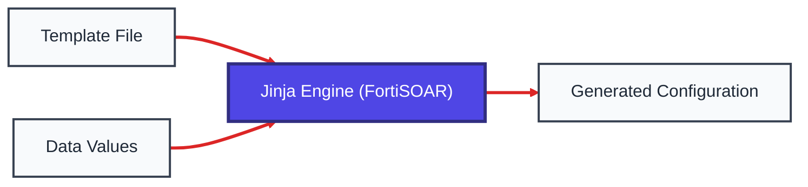
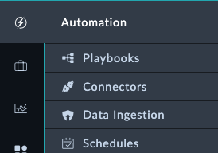
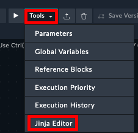
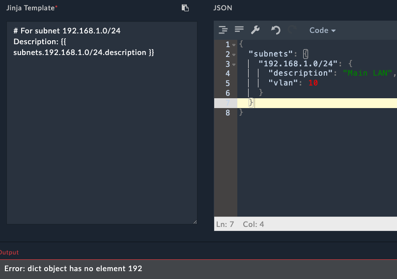

## Course Introduction

Welcome to this comprehensive guide on using Jinja templates for FortiGate configuration management. This tutorial is designed specifically for those who want to automate and standardize their Fortinet device configurations without requiring extensive programming knowledge.

## What is Jinja2?

Jinja2 is a powerful templating language that allows you to create dynamic text-based documents. Instead of manually creating individual configuration files for each FortiGate device, you can create one template and automatically generate customized configurations for hundreds of devices.

### Where is Jinja Used in Network Automation?

Some notable tools that use Jinja2 for network automation include:

- **Ansible** - For playbook automation and configuration templating
- **Napalm** - For network device configuration management
- **FMG Jinja scripts** - For generating device configurations
- **FortiSOAR** - The Playbook engine in SOAR uses Jinja2

## Why Use Jinja?

### Benefits

1. **Consistency** - Eliminate configuration errors and ensure standardization across all devices
2. **Efficiency** - Generate configurations for multiple devices in seconds instead of hours

## How Jinja Templating Works

Jinja2 needs two main components to generate a configuration:

1. **Template** - A configuration file with placeholders for dynamic values
2. **Data** - The specific values that will replace the placeholders



The template contains your standard FortiGate configuration with variables marked by special syntax, and the data provides the specific values for each device.

---

## Understanding JSON

Before diving into Jinja templates, let's understand JSON (JavaScript Object Notation) - the format we'll use to store our configuration data.

### What is JSON?

JSON is a simple, text-based format for storing and exchanging data. Think of it as a digital filing system where information is organized in a structured, easy-to-read way. Despite its name mentioning JavaScript, JSON is widely used across all programming languages and automation tools.

### Why JSON for Network Automation?

- **Human-readable** - Easy to read and edit
- **Widely supported** - Works with almost all automation tools
- **Simple structure** - Only a few rules to learn

### JSON Syntax Rules

JSON has only a few simple rules:

1. **Data is in name/value pairs** - `"hostname": "fw-branch-01"`
2. **Data is separated by commas** - `"hostname": "fw-01", "timezone": "EST"`
3. **Objects are wrapped in curly braces** - `{ "hostname": "fw-01" }`
4. **Arrays are wrapped in square brackets** - `["8.8.8.8", "1.1.1.1"]`
5. **Strings must be in double quotes** - `"hostname"` not `hostname`

### JSON Data Types

**Strings (Text):**

```json
{
  "hostname": "branch-office-fw-01",
  "description": "Main office firewall"
}
```

**Numbers:**

```json
{
  "port_number": 443,
  "vlan_id": 100,
  "mtu": 1500
}
```

**Lists/Arrays (Multiple Values):**

```json
{
  "dns_servers": [
    "8.8.8.8",
    "1.1.1.1"
  ],
  "allowed_ports": [
    80,
    443,
    22,
    3389
  ]
}
```

**Objects (Grouped Information):**

```json
{
  "interface": {
    "name": "port1",
    "ip": "192.168.1.1",
    "mask": "255.255.255.0"
  }
}
```

---

## Chapter 1: Basic Variable Substitution

Let's start with a simple FortiGate configuration example to understand how Jinja variable substitution works.

### Example: Basic System Configuration

Here's a typical FortiGate system configuration snippet:

```bash
config system global
    set hostname "branch-office-fw-01"
    set timezone "America/New_York"
end

config system dns
    set primary 8.8.8.8
    set secondary 1.1.1.1
end

config system ntp
    set ntpsync enable
    set server-mode disable
    set syncinterval 60
    config ntpserver
        edit 1
            set server "pool.ntp.org"
            set ntpv3 enable
        next
    end
end
```

### Converting to a Jinja Template

The first step is identifying which parts should be variables. In our example:

- Hostname changes per device
- Timezone might vary by location
- DNS servers might be location-specific
- NTP server could be regional

Here's the same configuration as a Jinja template:

```jinja2
config system global
    set hostname "{{ hostname }}"
    set timezone "{{ timezone }}"
end

config system dns
    set primary {{ dns_primary }}
    set secondary {{ dns_secondary }}
end

config system ntp
    set ntpsync enable
    set server-mode disable
    set syncinterval 60
    config ntpserver
        edit 1
            set server "{{ ntp_server }}"
            set ntpv3 enable
        next
    end
end
```

### Understanding the Syntax

In Jinja2, anything between `{{ }}` (double curly braces) tells the engine to:

1. Look for a variable with that name
2. Replace the entire `{{ variable_name }}` with the variable's value

### Data for the Template (JSON Format)

The data that feeds into our template is stored in JSON format:

```json
{
  "hostname": "branch-office-fw-01",
  "timezone": "America/New_York",
  "dns_primary": "8.8.8.8",
  "dns_secondary": "1.1.1.1",
  "ntp_server": "pool.ntp.org"
}
```

### Generated Output

When the template is processed with the JSON data above, it produces:

```bash
config system global
    set hostname "branch-office-fw-01"
    set timezone "America/New_York"
end

config system dns
    set primary 8.8.8.8
    set secondary 1.1.1.1
end

config system ntp
    set ntpsync enable
    set server-mode disable
    set syncinterval 60
    config ntpserver
        edit 1
            set server "pool.ntp.org"
            set ntpv3 enable
        next
    end
end
```

### Hands-On Exercise 1: Basic Variable Substitution

Let's practice basic variable substitution using the FortiSOAR Jinja Editor.

**To access the Jinja Editor:**

1. On the left pane, navigate to **Automation > Playbooks**
   

2. Create a new playbook or edit an existing one
3. Click the **Tools dropdown** on the top right and select **Jinja Editor**
   

**Exercise:**

In the Jinja Editor, you'll see two panels:

- **Left panel**: Enter your Jinja template
- **Right panel**: Enter your JSON Data
  

Click **Render** to see the output of the Template

**Task:** Create a simple firewall policy configuration using variables.

**Step 1:** Copy this JSON data into the right panel:

```json
{
  "policy_name": "Allow_Web_Traffic",
  "source_interface": "port1",
  "destination_interface": "port2",
  "source_address": "Internal_LAN",
  "destination_address": "all",
  "service": "HTTPS"
}
```

**Step 2:** Create a Jinja template in the right panel that generates this output:

```
config firewall policy
    edit 0
        set name "Allow_Web_Traffic"
        set srcintf "port1"
        set dstintf "port2"
        set srcaddr "Internal_LAN"
        set dstaddr "all"
        set service "HTTPS"
        set action accept
    next
end
```

Try writing the template yourself first!

{}

```jinja2
config firewall policy
    edit 0
        set name "{{ policy_name }}"
        set srcintf "{{ source_interface }}"
        set dstintf "{{ destination_interface }}"
        set srcaddr "{{ source_address }}"
        set dstaddr "{{ destination_address }}"
        set service "{{ service }}"
        set action accept
    next
end
```

{}

---

## Chapter 2: Working with Complex Data Structures

Real network configurations often require more complex data organization. Let's explore how to work with JSON objects and arrays in Jinja templates.

### Using JSON Objects for Interface Configuration

Instead of having separate variables for each interface attribute, we can group related information together using JSON objects:

```json
{
  "interface": {
    "name": "port1",
    "ip": "192.168.1.1",
    "netmask": "255.255.255.0",
    "description": "LAN Interface",
    "status": "up"
  }
}
```

**JSON Object Explanation:**

- The `interface` contains a nested object (another set of curly braces)
- Related information is grouped together logically
- Each property of the interface is clearly defined

### Template with JSON Object Access

Jinja provides convenient "dot notation" to access JSON object values:

```jinja2
config system interface
    edit "{{ interface.name }}"
        set ip {{ interface.ip }} {{ interface.netmask }}
        set description "{{ interface.description }}"
        set status {{ interface.status }}
    next
end
```

This approach makes templates more readable and data more organized.

### Hands-On Exercise 2: Working with JSON Objects

**Task:** Create a template for configuring multiple FortiGate interfaces using nested JSON objects.

**Step 1:** Copy this JSON data into the right panel:

```json
{
  "device_name": "FW-BRANCH-01",
  "interfaces": {
    "lan": {
      "name": "port1",
      "ip": "192.168.1.1",
      "netmask": "255.255.255.0",
      "description": "LAN Interface",
      "allowaccess": "ping https ssh"
    },
    "wan": {
      "name": "port2",
      "ip": "203.0.113.10",
      "netmask": "255.255.255.252",
      "description": "WAN Interface",
      "allowaccess": "ping"
    },
    "dmz": {
      "name": "port3",
      "ip": "10.10.10.1",
      "netmask": "255.255.255.0",
      "description": "DMZ Interface",
      "allowaccess": "ping https"
    }
  }
}
```

**Step 2:** Write a template that configures all three interfaces. Your output should look like this:

```
# Configuration for FW-BRANCH-01

config system interface
    edit "port1"
        set ip 192.168.1.1 255.255.255.0
        set description "LAN Interface"
        set allowaccess ping https ssh
    next
    edit "port2"
        set ip 203.0.113.10 255.255.255.252
        set description "WAN Interface"
        set allowaccess ping
    next
    edit "port3"
        set ip 10.10.10.1 255.255.255.0
        set description "DMZ Interface"
        set allowaccess ping https
    next
end
```

{}

```jinja2
# Configuration for {{ device_name }}

config system interface
    edit "{{ interfaces.lan.name }}"
        set ip {{ interfaces.lan.ip }} {{ interfaces.lan.netmask }}
        set description "{{ interfaces.lan.description }}"
        set allowaccess {{ interfaces.lan.allowaccess }}
    next
    edit "{{ interfaces.wan.name }}"
        set ip {{ interfaces.wan.ip }} {{ interfaces.wan.netmask }}
        set description "{{ interfaces.wan.description }}"
        set allowaccess {{ interfaces.wan.allowaccess }}
    next
    edit "{{ interfaces.dmz.name }}"
        set ip {{ interfaces.dmz.ip }} {{ interfaces.dmz.netmask }}
        set description "{{ interfaces.dmz.description }}"
        set allowaccess {{ interfaces.dmz.allowaccess }}
    next
end
```

{}

### Working with JSON Arrays

JSON arrays are perfect for lists of similar items like DNS servers, VLANs, or firewall rules:

```json
{
  "dns_servers": [
    "8.8.8.8",
    "1.1.1.1",
    "208.67.222.222"
  ],
  "vlans": [
    {
      "id": 10,
      "name": "LAN",
      "description": "Main LAN network"
    },
    {
      "id": 20,
      "name": "DMZ",
      "description": "DMZ network"
    }
  ]
}
```

**JSON Array Explanation:**

- Arrays are wrapped in square brackets `[ ]`
- Items in arrays are separated by commas
- Arrays can contain simple values (strings, numbers) or complex objects

### Hands-On Exercise 3: Accessing Array Elements

**Task:** Practice accessing individual elements from JSON arrays.

**Step 1:** Copy this JSON data:

```json
{
  "ntp_servers": [
    "0.pool.ntp.org",
    "1.pool.ntp.org",
    "2.pool.ntp.org"
  ],
  "admin_users": [
    {
      "username": "admin",
      "profile": "super_admin",
      "password": "FortiGate123!"
    },
    {
      "username": "monitor",
      "profile": "read_only",
      "password": "Monitor456!"
    }
  ]
}
```

**Step 2:** Create a template that:

1. Configures the first two NTP servers (using array index notation)
2. Creates both admin users

Expected output:

```
config system ntp
    set ntpsync enable
    config ntpserver
        edit 1
            set server "0.pool.ntp.org"
        next
        edit 2
            set server "1.pool.ntp.org"
        next
    end
end

config system admin
    edit "admin"
        set password "FortiGate123!"
        set accprofile "super_admin"
    next
    edit "monitor"
        set password "Monitor456!"
        set accprofile "read_only"
    next
end
```

{}

```jinja2
config system ntp
    set ntpsync enable
    config ntpserver
        edit 1
            set server "{{ ntp_servers[0] }}"
        next
        edit 2
            set server "{{ ntp_servers[1] }}"
        next
    end
end

config system admin
    edit "{{ admin_users[0].username }}"
        set password "{{ admin_users[0].password }}"
        set accprofile "{{ admin_users[0].profile }}"
    next
    edit "{{ admin_users[1].username }}"
        set password "{{ admin_users[1].password }}"
        set accprofile "{{ admin_users[1].profile }}"
    next
end
```

{}

{}
What if we added another ntp server or user? With this declaration we'd have to update our JSON and our jinja template. Could this be optimized by using a loop somehow?
{}

### Special Characters in JSON Property Names

Sometimes you might have property names with special characters (like IP addresses as keys). When this happens, you can't use dot notation and must use bracket notation instead:

```json
{
  "subnets": {
    "192.168.1.0/24": {
      "description": "Main LAN",
      "vlan": 10
    },
    "10.0.0.0/8": {
      "description": "Private Network",
      "vlan": 20
    }
  }
}
```

Template usage:

```jinja2
# For subnet 192.168.1.0/24
Description: {{ subnets['192.168.1.0/24'].description }}
VLAN: {{ subnets['192.168.1.0/24'].vlan }}
```

### Hands-On Exercise 4: Bracket Notation

**Task:** Use the above JSON in the Jinja Editor, and try to access the subnets without using bracket notation. What kind of error do you see?

{}

We see an error that the subnets dictionary doesn't have a key named "192" . This is because the special character `.` is getting treated as its own key.
{}

### JSON Validation Tips

**Common JSON Mistakes to Avoid:**

1. **Missing commas between items**
2. **Using single quotes instead of double quotes**
3. **Trailing commas after the last item**
4. **Forgetting to close braces or brackets**

**Valid JSON:**

```json
{
  "hostname": "fw-01",
  "ports": [
    80,
    443
  ]
}
```

### Hands-On Exercise 5: Fix the JSON

**Task:** The following JSON has several errors. Try to fix them in the Jinja Editor.

```json
{
  'hostname': "fw-01"
  "interfaces": [
    {
      "name": "port1",
      "ip": "192.168.1.1"
    },
    {
      "name": 'port2',
      "ip": "10.0.0.1"
    }
  ]
}
```

{}
Notice how SOAR will also mention that there were issues with the JSON, which speeds up the resolution process.


{}
{}
The corrected JSON:

```json
{
  "hostname": "fw-01",
  "interfaces": [
    {
      "name": "port1",
      "ip": "192.168.1.1"
    },
    {
      "name": "port2",
      "ip": "10.0.0.1"
    }
  ]
}
```

Errors fixed:

1. Changed single quotes to double quotes for 'hostname'
2. Added missing comma after the hostname line
3. Removed trailing comma after "192.168.1.1"
4. Changed single quotes to double quotes for 'port2'
5. Removed trailing comma after the last array element
   {}

## Chapter 3: Handling Undefined Variables

Understanding how Jinja handles missing variables is crucial for creating robust templates.

### Default Behavior

By default, if a variable is not defined in your JSON data, Jinja will replace it with an empty string. This can lead to unexpected results in your FortiGate configurations.

### Hands-On Exercise 6: Understanding Undefined Variables

**Task:** See what happens when variables are missing from your JSON data.

**Step 1:** Copy this JSON data (notice it's missing the `location` field):

```json
{
  "hostname": "FW-HQ-01",
  "timezone": "America/New_York"
}
```

**Step 2:** Use this template:

```jinja2
config system global
    set hostname "{{ hostname }}"
    set timezone "{{ timezone }}"
    set location "{{ location }}"
end
```

**Step 3:** Observe the output. What happens to the location line?

{}
The output will be:

```
config system global
    set hostname "FW-HQ-01"
    set timezone "America/New_York"
    set location ""
end
```

The missing `location` variable is replaced with an empty string, which could cause a configuration error on the FortiGate. In later chapters, we'll learn how to handle missing variables gracefully using conditional statements and default values.
{}

---

## Chapter 4: Adding Comments to Templates

Comments are essential for maintaining templates, especially when multiple team members work on the same configurations.

### Comment Syntax

Jinja uses `{# ... #}` for comments. Everything between these markers is ignored during template processing.

```jinja2
{# FortiGate Basic System Configuration Template #}
{# Version: 1.0 #}
{# Author: Network Team #}

config system global
    set hostname "{{ hostname }}"  {# Device hostname #}
    set timezone "{{ timezone }}"
end
```

### Using Comments for Template Management

Comments are valuable for:

1. **Documenting template purpose and version**
2. **Explaining complex configuration sections**
3. **Noting dependencies or requirements**
4. **Temporarily disabling configuration sections during testing**

### Hands-On Exercise 7: Working with Comments

**Task:** Practice using comments in your templates.

**Step 1:** Use this JSON data:

```json
{
  "hostname": "FW-TEST-01",
  "timezone": "UTC",
  "ntp_server": "pool.ntp.org",
  "admin_timeout": 480
}
```

**Step 2:** Use this template:

```jinja2
{# 
   FortiGate System Configuration Template
   Version: 2.0
   Last Updated: 2025-06-09
   Purpose: Standard system settings for all branch firewalls
#}

config system global
    set hostname "{{ hostname }}"  {# Unique identifier for this device #}
    set timezone "{{ timezone }}"  {# Use UTC for global deployments #}
    set admin-timeout {{ admin_timeout }}  {# Session timeout in seconds #}
end

{# NTP configuration - uncomment when ready to deploy
config system ntp
    set ntpsync enable
    config ntpserver
        edit 1
            set server "{{ ntp_server }}"
        next
    end
end
#}

{# TODO: Add DNS configuration in next version #}
```

**Step 3:** Check the output. Notice how all comments are removed from the final configuration.

{}

```
config system global
    set hostname "FW-TEST-01"
    set timezone "UTC"
    set admin-timeout 480
end
```

All comments, including the commented-out NTP section, are completely removed from the output.
{}

---

## Summary

In this hands-on guide, you've learned:

1. **Basic variable substitution** using `{{ variable_name }}` syntax
2. **Working with JSON objects** using dot notation
3. **Accessing array elements** using index notation
4. **Handling special characters** with bracket notation
5. **Understanding undefined variables** and their behavior
6. **Using comments** for documentation and debugging

These fundamentals form the foundation for more advanced Jinja features like loops, conditionals, and filters, which you'll explore in future lessons.

### Practice Tips

- Always test your templates in the FortiSOAR Jinja Editor before deploying
- Start with simple templates and gradually add complexity
- Use meaningful variable names that clearly indicate their purpose
- Keep your JSON data well-organized and properly formatted
- Add comments to document complex template sections