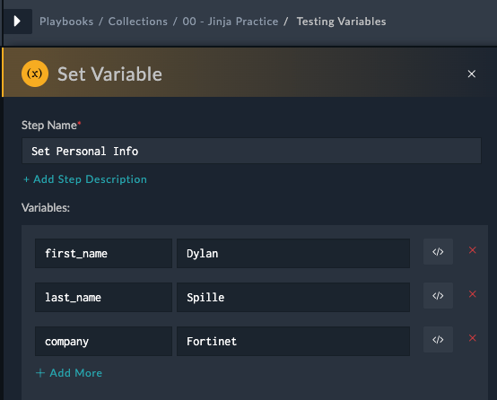
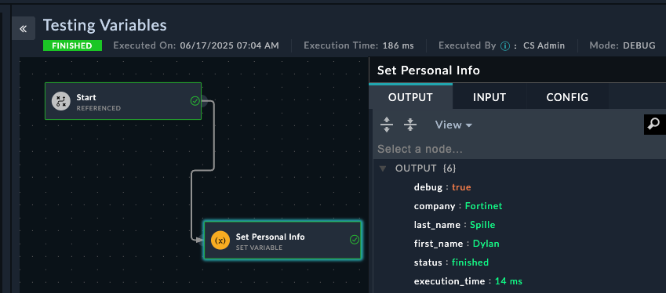
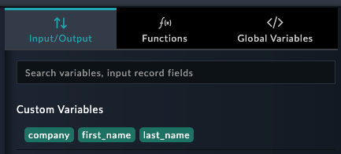
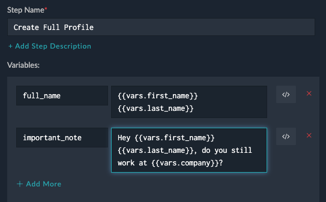
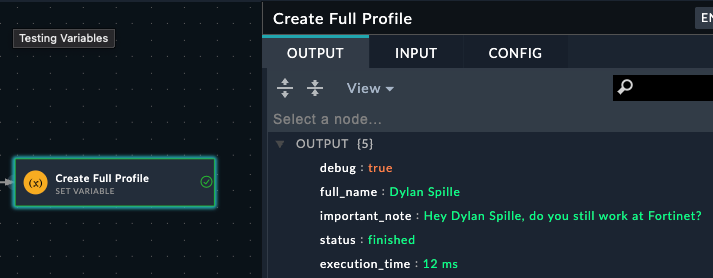
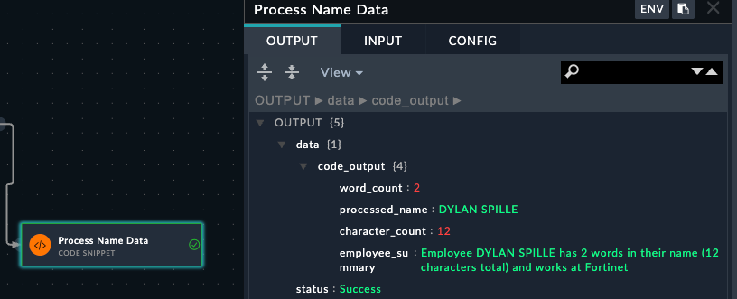
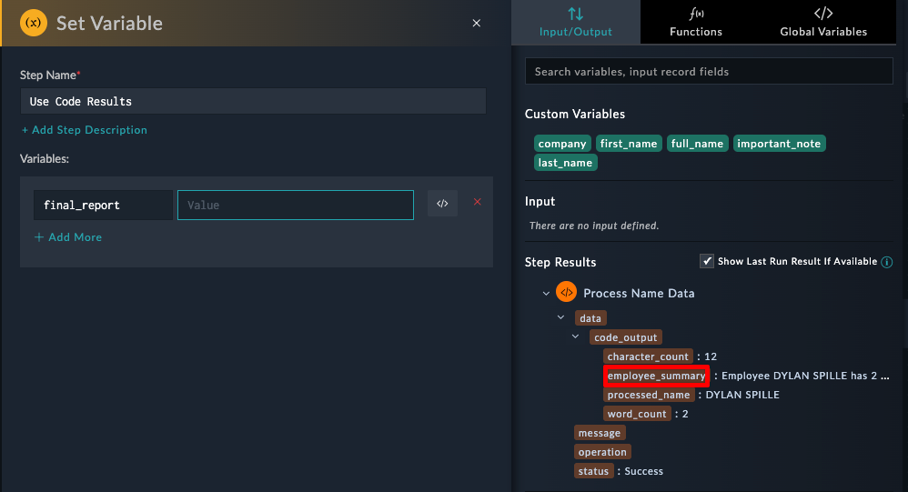
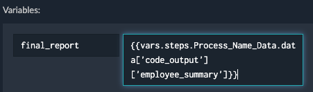
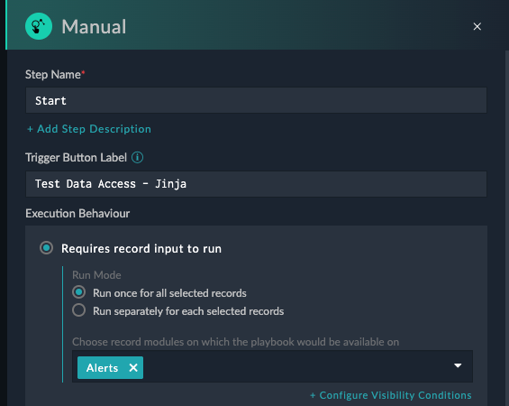
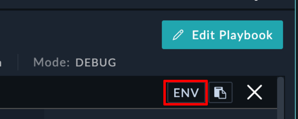

Now that you have the foundations of Jinja down, lets transition into applying that knowledge to SOAR. We'll cover FortiSOAR specific Jinja expressions, the Jinja Expression Helper, as well as how to use Jinja in playbooks

## Understanding Variables in FortiSOAR

All data in SOAR is accessed using the `vars` key with Jinja2 templating. Variables are accessed using the pattern:

```jinja2
{{vars.<variable_name>}}
```

The `vars` object contains all available data during playbook execution, including:

- Variables created in previous steps
- Input data from triggers
- Global variables
- Step outputs

---

## Hands-On Practice 1: Creating and Using Variables

### Objective

Learn to create variables and reference them in subsequent steps using Jinja2 templating.

### Steps

#### 1. Create Your Test Playbook

1. Navigate to **Automation > Playbooks**
2. Create a new collection called `00 - Jinja Practice`
3. Create a new playbook in your workshop collection:
    - **Name**: `Testing Variables`
    - **Description**: `Practice creating and using Jinja2 variables`
4. Click **Create**

#### 2. Configure the Start Step

1. Select **Reference** trigger (this allows the playbook to be called from other playbooks)
2. Click **Save**

#### 3. Create Your First Variables

1. Drag to create a new step → Select **Set Variable**
2. Configure the step:
    - **Step Name**: `Set Personal Info`
    - **Variables**:
        - **Name**: `first_name` | **Value**: `[Your First Name]`
        - **Name**: `last_name` | **Value**: `[Your Last Name]`
        - **Name**: `company` | **Value**: `[Your Company Name]`
          
3. Click **Save**

#### 4. Test Your Variables

1. Click **Save Playbook**
2. Click the **Play** button to run the playbook
3. Click **Trigger Playbook** to execute
4. In the execution history, click on the **Set Personal Info** step
5. Verify you can see all three variables with their values
   
6. Click **Close** to exit execution history

#### 5. Use Variables to Create New Data

1. In the playbook editor, drag from **Set Personal Info** to create a new step
2. Select **Set Variable** again
3. Configure the step:
    - **Step Name**: `Create Full Profile`
    - **Variables**:
        - **Name**: `full_name`
        - **Value**: `{{vars.first_name}} {{vars.last_name}}`

{}
**Using Dynamic Values
**: Instead of typing Jinja2 manually, you can see the Dyanmic Values page by clicking into any field in SOAR. You'll see your previously created variables at the top of the panel. Clicking these variables will automatically add the jinja to reference that value to your step. This helps prevent typos in variable names.

{}

#### 6. Create a Template Message

1. Add another variable to the same step:
    - **Name**: `important_note`
    - **Value**: `Hey {{vars.first_name}} {{vars.last_name}}, do you still work at {{vars.company}}?`
      
2. Click **Save**

#### 7. Test the Complete Workflow

1. Click **Save Playbook**
2. Run the playbook again
3. Check the **Create Full Profile** step results
4. Verify that:
    - `full_name` shows your complete name
    - `important_note` shows the templated message with all variables filled in
      

{}
**Common Mistake**: Variable names are case-sensitive and must match exactly. `first_name` ≠ `First_Name`. Use the Dynamic Values panel to avoid typos!
{}

#### 8. Add Code Snippet Processing

1. From **Create Full Profile**, drag to create a new step → Select **Code Snippet**
2. Configure the step:
    
    - **Step Name**: `Process Name Data`
    - **Action**: Execute Python Code
    - **Code**:
        ```python
        # Get the full name from the previous step
        name = "{{vars.full_name}}"
        company = "{{vars.company}}"

        # Perform simple operations
        name_length = len(name)
        name_upper = name.upper()
        name_words = name.split()
        word_count = len(name_words)

        # Create a processed summary
        summary = f"Employee {name_upper} has {word_count} words in their name ({name_length} characters total) and works at {company}"

        # Return data for use in next steps
        output = {
            'processed_name': name_upper,
            'character_count': name_length,
            'word_count': word_count,
            'employee_summary': summary
        }
        print(output)
        ```

3. Click **Save**

#### 9. Test Code Snippet Output

1. Save and run the playbook
2. Check the **Process Name Data** step execution results
3. Expand the **output** data structure
4. Note the JSON structure of the output - this shows you the data paths available
   

{}
**Understanding Step Output**: Code snippets return data in the `data` variable. This becomes accessible as `{{vars.steps.Process_Name_Data.data.code_output.processed_name}}` or `{{vars.steps.Process_Name_Data.data.code_output.employee_summary}}` in subsequent steps.
{}

#### 10. Access Code Snippet Results

{}
Use the Dynamic values page to pick the results from the code snippet step. When clicking inside the **Value**, check the box **Show Last Run Result if available**, then expand the arrows showing the previous data. Clicking on the key **employee_summary**, fills in the Jinja for you



{}

1. Add another **Set Variable** step after the code snippet
2. Configure:
    - **Step Name**: `Use Code Results`
    - **Variables**:
        - **Name**: `final_report`
        - **Value**:
        - **Name**: `name_stats`
        - **Value**: `Name "{{vars.processed_name}}" has {{vars.steps.character_count}} characters and {{vars.steps.Process_Name_Data.word_count}} words.`

#### 11. Verify Data Path Access

1. Save and run the complete playbook
2. In the execution results, click on **Use Code Results** step
3. Verify that all variables contain the processed data from the code snippet
4. If any variables are empty, check the execution results of **Process Name Data** to verify the exact JSON path structure

#### 12. Correct Issues

The jinja for `name_stats` has been purposefully set to be incorrect. Try to find the issues with each jinja expression and save the playbook and rerun to check the results

{}
**Data Path Discovery**: Always check the execution results of code snippet steps to see the exact structure of returned data. The JSON structure shown determines how you access the data with `{{vars.steps.Step_Name.field_name}}`.
{}

---

## Understanding Input Data

When triggering playbooks manually from records (alerts, incidents, etc.), all record data is accessible via `vars.input.records`. Since `records` is a list, you typically access data using:

```jinja2
{{vars.input.records[0].<field_name>}}
```

---

## Hands-On Practice 2: Working with Alert Data

### Objective

Learn to access and manipulate data from FortiSOAR records using manual triggers.

### Steps

#### 1. Create Alert Data Playbook

1. Create a new playbook:
    - **Name**: `Working with Alert Data`
    - **Description**: `Practice accessing alert data with Jinja2`

#### 2. Configure Manual Trigger

1. Select **Manual** trigger
2. Configure:
    - **Trigger Button Label**: `Test Data Access - Jinja`
    - **Requires Record**: True
    - **Module**: `Alerts`
      
3. Click **Save**

#### 3. Extract Alert Data

1. Drag from the start step and click **Set Variable**
2. Use the **Step Name**: `Extract Alert Data``
    - **Name**: `alert_name` | **Value**: `{{vars.input.records[0].name}}`
    - **Name**: `alert_severity` | **Value**: `{{vars.input.records[0].severity}}`
    - **Name**: `alert_type` | **Value**: `{{vars.input.records[0].type}}`
    - **Name**: `source_ip` | **Value**: `{{vars.input.records[0].sourceIp}}`
3. Save the Step
4. Save the playbook
   {}
   If you don't save the playbook, you won't be able to see the playbook from the alerts page
   {}

#### 4. Create a Test Alert

1. Navigate to **Incident Response > Alerts**
2. Click **+ Add**
3. Fill in basic information:
    - **Name**: `Sample Alert for Playbook Testing`
    - **Description**: `This is a test alert for learning Jinja2 templating`
    - **Severity**: `Medium`
    - **Type**: `Brute Force Attempts`
    - **Source IP**: `192.168.1.100`
4. Click **Save**
    

#### 5. Test Playbook from Alert

4. Click **Execute** and select **Test Data Access - Jinja**
    
5. View the execution history at the top right
    
6. Click on the **Extract Alert Data** step
7. Verify all variables contain the correct data from your alert
    

#### 6. Explore Available Data

1. In the execution history, click **ENV** at the top
    
2. Expand `vars > input > records > [0]`
    
3. Scroll through and explore all available fields
4. Notice how the `name` field matches your alert name

{}
**Data Exploration**: The ENV view shows all data available during playbook execution. This is invaluable for understanding what fields are available and how to access them with Jinja2.
{}

You should now understand why we could access the alert data fro the playbook with `vars.input.records[0].<field_name>`

---

## Hands-On Practice 3: Advanced Jinja2 Templating

### Objective

Learn advanced Jinja2 techniques for data manipulation and conditional logic.

### Steps

#### 1. Create Advanced Templating Playbook

1. Create a new playbook:
    - **Name**: `Advanced Jinja2 Techniques`
    - **Description**: `Learn advanced templating and data manipulation`

#### 2. Set Up Manual Trigger

1. Configure **Manual** trigger on **Alerts** module
2. Set button label as `🚀 Advanced Templating`

#### 3. Create Data Analysis Step

1. Add **Set Variable** step:
    - **Step Name**: `Analyze Alert Data`
    - **Variables**:

**Risk Assessment**:

```jinja2
Name: risk_level
Value: High RiskMedium RiskLow Risk
```

**IP Classification**:

```jinja2
Name: ip_classification
Value: Internal NetworkPrivate NetworkExternal Network
```

**Alert Summary**:

```jinja2
Name: alert_summary
Value: Alert "{{vars.input.records[0].name}}" from {{vars.input.records[0].sourceIp | default('Unknown IP')}} is classified as {{vars.steps.Analyze_Alert_Data.risk_level}} due to {{vars.input.records[0].severity | lower}} severity.
```

#### 4. Add Conditional Processing

1. Create new step → Select **Decision**
2. Configure:
    - **Step Name**: `Check Risk Level`
    - **Condition**: `{{vars.risk_level == "High Risk"}}`

#### 5. High Risk Path

1. From **True** output, add **Set Variable** step:
    - **Step Name**: `High Risk Actions`
    - **Variables**:
        - **Name**: `required_actions`
        - **Value**:
          ```jinja2
          IMMEDIATE ACTIONS REQUIRED:
          1. Block IP: {{vars.input.records[0].sourceIp}}
          2. Isolate affected systems
          3. Notify security team immediately
          4. Begin incident response procedures
          
          Alert Details:
          - Name: {{vars.input.records[0].name}}
          - Time: {{vars.input.records[0].createDate | strftime('%Y-%m-%d %H:%M:%S')}}
          - Classification: {{vars.ip_classification}}
          ```

#### 6. Low Risk Path

1. From **False** output, add **Set Variable** step:
    - **Step Name**: `Standard Processing`
    - **Variables**:
        - **Name**: `standard_actions`
        - **Value**:
          ```jinja2
          STANDARD MONITORING:
          - Continue monitoring {{vars.input.records[0].sourceIp}}
          - Log activity for trend analysis
          - Review in next security meeting
          
          Risk Assessment: {{vars.risk_level}}
          ```

---

### String Manipulation

```jinja2
<!-- Case conversion -->
{{hostname | upper}}
{{alert_type | lower}}
{{description | title}}

<!-- String operations -->

Domain Controller Detected


<!-- Clean and format data -->
Clean IP: {{ip_address | trim | replace(' ', '')}}
Formatted Name: {{alert_name | truncate(50) | title}}
```

---

## Debugging Jinja2 Templates

### Common Issues and Solutions

#### 1. Variable Not Found Errors

**Problem**: `UndefinedError: 'dict object' has no attribute 'fieldname'`

**Solution**: Use default filters and check data structure

```jinja2
<!-- Instead of -->
{{vars.input.records[0].nonexistent_field}}

<!-- Use -->
{{vars.input.records[0].nonexistent_field | default('Not Available')}}
```

#### 2. Type Conversion Issues

**Problem**: Comparing strings to numbers

**Solution**: Convert types explicitly

```jinja2
<!-- Convert to string for comparison -->


<!-- Convert to integer for math -->

```

#### 3. List Access Errors

**Problem**: Trying to access list items that don't exist

**Solution**: Check list length first

```jinja2

{{vars.input.records[0].name}}

```

### Testing Techniques

#### 1. Use Set Variable Steps for Testing

Create temporary Set Variable steps to test your Jinja2 expressions:

```jinja2
Name: test_output
Value: {{your_complex_jinja_expression}}
```

#### 2. Progressive Building

Start simple and add complexity:

```jinja2
<!-- Step 1: Basic access -->
{{vars.input.records[0].name}}

<!-- Step 2: Add conditions -->
{{vars.input.records[0].name}}

<!-- Step 3: Add formatting -->
Alert: {{vars.input.records[0].name | upper | truncate(30)}}
```

#### 3. Use ENV View

Always check the ENV view in execution history to understand available data structure.