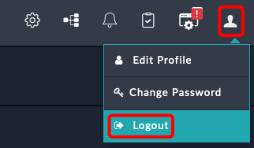
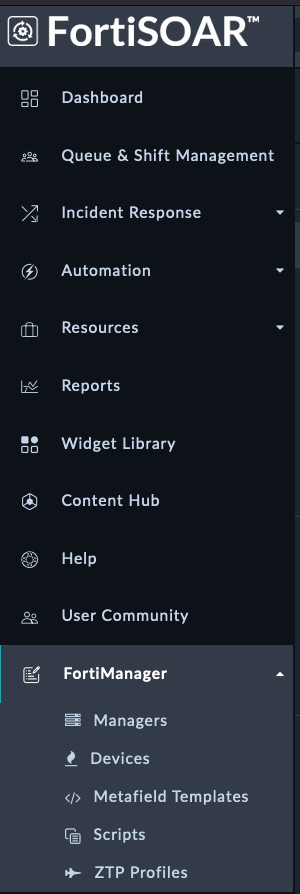
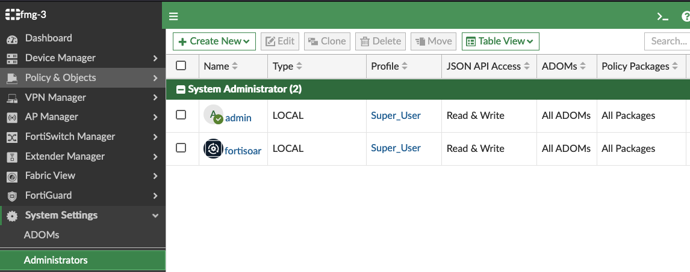

# ZTP Solution Pack Setup Guide

This guide walks you through the complete setup process for the ZTP (Zero Touch Provisioning) Solution Pack, including installation, configuration, and user setup.

## Prerequisites

Before beginning, ensure you have administrative access to both FortiSOAR and FortiManager systems.

## Step 1: Install the ZTP Framework

1. Navigate to the **Content Hub** by clicking the Content Hub tab in the left navigation pane
2. Search for `FortiManager ZTP Flow` in the Content Hub
   
   

3. Open the Solution Pack and click the **Install** button
4. Wait for the installation to complete

{}
Important configuration steps are required before the ZTP Solution Pack can be used effectively.
{}

## Step 2: Configure Code Snippet Connector

1. Ensure Connectors are not filtered out in the Content Hub view
2. Search for `Code Snippet` in the Content Hub
   
   

3. Open the connector and check the **Mark as Default Configuration** checkbox
4. Click **Save**
   
   

## Step 3: Configure System Settings

### Access System Settings

Navigate to System Settings by clicking the gear icon in the top right corner of the FortiSOAR UI.


### Configure Playbook Appliance Role

The configuration steps vary depending on your FSR version:

#### For FSR Version 7.6.0 and Later

1. In the left sidebar, scroll down and click **Access Keys**
2. Select the **Appliances** tab
   
   

#### For FSR Version Prior to 7.6.0

1. In the left sidebar, scroll down and click **Appliances**
   
   

### Complete Appliance Configuration

**Note:** These steps apply to all FSR versions after accessing the appropriate section above.

1. Click on the **Playbook** record (click the record name, not the checkbox)
2. In the Roles table, check the box for **FortiManager-Playbook-Appliance**
   
   

3. Click **Save** at the bottom of the page

## Step 4: Configure User Roles and Access

### Set Up CS Admin User Role

1. In the left sidebar, scroll down and click **Users**
   
   

2. Click the **CS Admin** record (click the record name, not the checkbox)
3. In the Roles table, check the box for "FortiManager-Admin"
   
   

4. Click **Save** at the bottom

### Switch to CS Admin Account

1. Log out of the current FortiSOAR session
   
   

2. Log back into FortiSOAR using the CS Admin credentials:
    - **Username:** `csadmin`
    - **Password:** `$3curityFabric`

3. Verify the setup by confirming you can see the **FortiManager** section in the bottom left navigation pane
   
   

## Step 5: Configure FortiManager API Access

### Create FortiManager API Account

1. Access the FortiManager UI using the IP address from your Evoke instance
2. Log in with the following credentials:
    - **Username:** `admin`
    - **Password:** `$3curityFabric`
3. Open the integrated SSH terminal to proceed with API account configuration
   
   

4. Run the following command to create a new API Admin (Use the copy button below)
   ```shell
   config system admin user
       edit "fortisoar"
           set password fortinet
           set profileid "Super_User"
           set avatar "/9j/4AAQSkZJRgABAQAAAQABAAD/2wBDAAMCAgMCAgMDAwMEAwMEBQgFBQQEBQoHBwYIDAoMDAsKCwsNDhIQDQ4RDgsLEBYQERMUFRUVDA8XGBYUGBIUFRT/2wBDAQMEBAUEBQkFBQkUDQsNFBQUFBQUFBQUFBQUFBQUFBQUFBQUFBQUFBQUFBQUFBQUFBQUFBQUFBQUFBQUFBQUFBT/wAARCABAAEADAREAAhEBAxEB/8QAHwAAAQUBAQEBAQEAAAAAAAAAAAECAwQFBgcICQoL/8QAtRAAAgEDAwIEAwUFBAQAAAF9AQIDAAQRBRIhMUEGE1FhByJxFDKBkaEII0KxwRVS0fAkM2JyggkKFhcYGRolJicoKSo0NTY3ODk6Q0RFRkdISUpTVFVWV1hZWmNkZWZnaGlqc3R1dnd4eXqDhIWGh4iJipKTlJWWl5iZmqKjpKWmp6ipqrKztLW2t7i5usLDxMXGx8jJytLT1NXW19jZ2uHi4+Tl5ufo6erx8vP09fb3+Pn6/8QAHwEAAwEBAQEBAQEBAQAAAAAAAAECAwQFBgcICQoL/8QAtREAAgECBAQDBAcFBAQAAQJ3AAECAxEEBSExBhJBUQdhcRMiMoEIFEKRobHBCSMzUvAVYnLRChYkNOEl8RcYGRomJygpKjU2Nzg5OkNERUZHSElKU1RVVldYWVpjZGVmZ2hpanN0dXZ3eHl6goOEhYaHiImKkpOUlZaXmJmaoqOkpaanqKmqsrO0tba3uLm6wsPExcbHyMnK0tPU1dbX2Nna4uPk5ebn6Onq8vP09fb3+Pn6/9oADAMBAAIRAxEAPwD89dO0661e/t7Kyt5Lu8uHEUUEKlnkYnAUAdSTXtHlH01afsBeKNN0+1m8Z+NfBvgG8uUEi6breqot0qkZG5Bkisfarormvs31diT/AIYZs/8AouHw3/8ABp/9al7X+6w9n5oP+GGbP/ouHw3/APBp/wDWo9r/AHWHs/NB/wAMM2f/AEXD4b/+DT/61Htf7rD2fmg/4YZs/wDouHw3/wDBp/8AWo9r/dYez80JJ+wB4k1i2uP+EO8eeCfHGowoZP7M0nVkNzIAMnYjYJo9slurB7N9GfM2s6NfeHdVu9M1O0lsdQtJGhntp0KvG4OCCDW6d9UZbH0Z/wAE9dOtZfj/AC6zcwJcyeHtCv8AWLZJBkedGgCH8C+fwrGt8NjWl8Vz598W+LNV8ceI9Q13WryW/wBTv5mnnnmcszMxyevb2rZJJWRk3fVmRTA634W/DLWfi7420zwtoSI2pai5igMuRHv2kgMwBxnGM1MpKKuxpOTsjG8T+GNV8Ga/faJrdjNpuq2MrQ3FrOu143HUEU001dCatozLpgaGga9qHhfWbPVdLu5rHULOVZoLiByjo6nIII9xSavow2PpH9v+KLU/iN4O8WeRHBf+KPCthql95S7Q9wybXfA9SuaxpaJrsa1N0w/4J7f8lY8Y/wDYmap/KOit8K9Qpbs+Xq3Mj7H/AGRf2OdB8X+DLv4ufF3UToHw108s0UTt5bX5U4J3ddmRt45Y8CuapUafLHc2hBNc0tj2fwd/wUd+GfgPx7pHhz4e/DKz0DwRHKYp9SFsTezoFOPLjQbtzHAG4sTnnFZOjJq8nqaKqk7JaHz34g/ac8MfFb9rqHx38V/CG/wlDvtG0WGACVYtjLG0w4MjKWDHvxgdBWypuMOWL1MnNSneSOk/a1/Y48OaH4FtvjB8GtQ/tz4c3gD3NqjmR7AscZB67MnBDcqevsqdRt8s9ypwVuaOx8Y10mB9Sft1/wCu+Dn/AGIun/8As1YUuvqbVOnoM/4J7f8AJWPGP/Ymap/KOit8K9RUt2fPPgjw4/jDxloWhIxVtSvoLPcOq+Y4XP4ZzWrdlczSu7H3F/wVB8bTeHdT8CfBPw9m10DQ9Lgmks7bhZZTlIlIHXCrnHq+a5qCvebN6ztaKPdP2f8A9n74S/s8fAHwh8Vfip4R/wCEa8WaGGubi7vpJHmEzSERnylbazEbdqkEqfTrWU5ynJxi9DSMYxipSRo/GH4I/Br9qH4I+Nvip8OvCg8UeLNWtD9muLSWSGf7TGQB+6Y7UcY5G3LDrnNKMpwkoyeg5RjOLlE+c/8AgmD44mufGfjD4KeJ4nufDviHT5/M065ziKZBtkAB+6WUkHHdQe1bV1opoyovVxZ8WfEfwq3gX4g+JfDjtvfSdRuLEt6+XIyf0rpi7pMwas7H0D+3X/rvg5/2Iun/APs1ZUuvqa1OnoM/4J7f8lY8Y/8AYmap/KOit8K9RUt2fOXhe51K08SaXNo0skGrpdRm0liOHWbcNhHvnFbPbUyXkfWv7WH7IXxP+GttH8SvGvxH03xJcOsRW61O9db13CgrFGkmS5X0BwAK56dSMvdSNpwkvebPr74Q/Fb4c/tf/s4eF/h38U/HFhrHjPXwyzWltKLe9WeNyyHaBgOABg4w3YGueUZU5OUVobxcZxtJ6l3x34++F37GP7P/AIy+Hvw78b2Gi+NNHtWngtr6UT3j3UhBB2kYZjkcAYUckYFJKVSSlJaDbjTi0mfN/wDwTe+C3jCH44j4q+KLKa08OHRrjVE1qXH2e5MvBw44DL8xZeCMcgVtWkuXlRlSi+bmZ8V/GHxPB41+LHjLxBbArbaprF3eRg9lkmZh+hrqirRSOeTu2z3T9uv/AF3wc/7EXT//AGasqXX1NanT0Gf8E9v+SseMf+xM1T+UdFb4V6ipbs+cvDHiG68JeItN1qyETXun3CXMHnJvQSIcqSO+CAa2aurGSdnc+/vgN+1P4T/an+Ht98IP2gdRVdRupnm0nxNPtj2ysSVUt0R1LELngj5T2rknTdN88DpjNTXLM80+IX/BNf40/DLX4tT8ChPF+nxSCay1fQ7xILiPByrbWZWDe6Fh71arQkrSJdKS2IfB3/BN/wCO3xS1m61TxhHH4YikzLcat4jv1mmkbHdVZnJ6ctge9DrQjohKlN7l74eft0a/+zX8H9U+DU/hbTPElzYXl5ZveXd2ZbUwOSGjCp94ZLnO7BDCk6SnLnuNVHBctj491nUU1bVbu9jtILBJ5GkW1tVIiiBP3VBJOB9a6UYH0v8At1/674Of9iLp/wD7NWNLr6m1Tp6Gb/wT/wBd0/Tf2gV0rUbpLKLxFo97okc8hCqssyDywSemWQD8aKy926FTfvHifxF+HWv/AAs8W6h4d8R6dcabqNnK0TJPGVDgHAdSeqnqCK1jJSV0ZtOLszmaoR6b4F/aY+Kfw1tFtPDnjvW9Ms14FtHdsYx9FOQKzcIy3RSlJbMd43/ad+K3xGtGtPEPj3XNRtGGGt3u2WMj3UYFChFbIHOT3Z5j1rQk3PBXgjW/iH4kstC8Pabc6pqd3IsccFtGXPJxk46AdyeBUtqKuxpN6I+gP2/NQs7f4n+GfCVrdRXs/hHw3Y6LeSwncv2hEzIoPfBOKypbN9zSpvbsfMsE8ltMksTtFKjBldDgqR0INbmR9HeHf+CgPxb0bSLbTtQu9H8VQ2yhIZPEGmJcyqoGAN/DHHuTWDox6GqqSNP/AIeJfEX/AKFrwN/4IR/8XR7GPdh7Rh/w8S+Iv/QteBv/AAQj/wCLo9jHuw9ow/4eJfEX/oWvA3/ghH/xdHsY92HtGH/DxL4i/wDQteBv/BCP/i6PYx7sPaMo61/wUI+LmoabcWelz6J4VFwpSSfQdKjt5iD1w53EfUYNHsY9Q9pI+b7y8n1C7murqZ7i5mcySSysWZ2JySSepNbGR//Z"
           set rpc-permit read-write
       next
   end
   end
   ```

5. Verify the new user was created by navigating to **System Settings > Administrators** and checking for the new user


