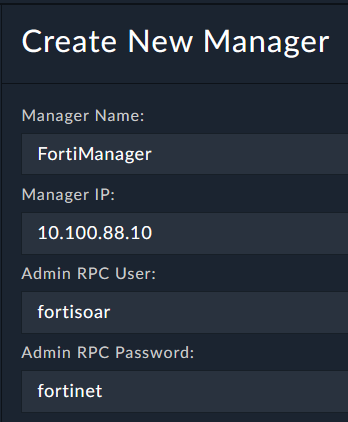
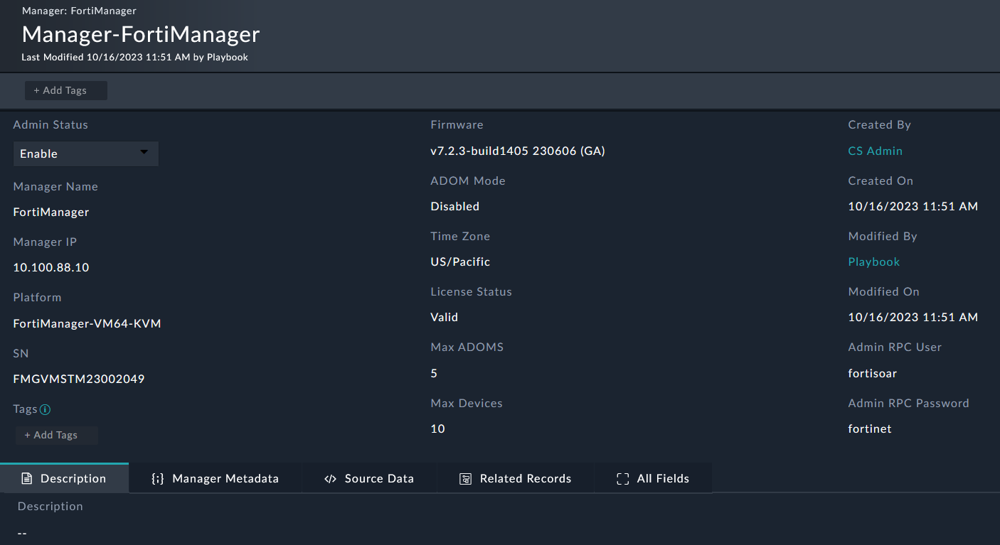
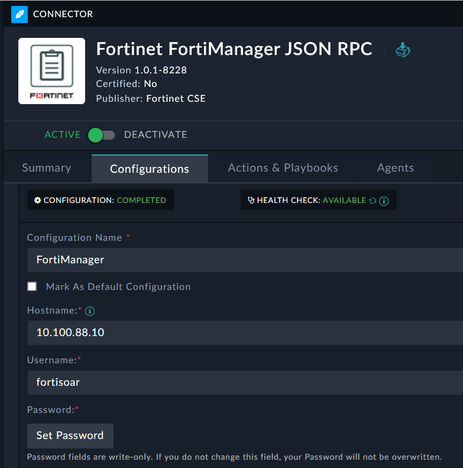

We will begin configuring FortiSOAR to connect to FortiManager, which allows us to **manage** FortiManager.

---

1. Navigate to **FortiManager > Managers**  and click the  button to add a new record.
   
2. Enter the following information:
    - **Manager Name**: ```FortiManager```
    - **Manager IP**: ```10.100.88.10```
    - **Admin RPC Username**: ```fortisoar```
    - **Admin RPC Password**: ```fortinet```
   
   

3. Click **Save**.

---
You will now see the FortiManager record populated with information from the FortiManager API. FortiSOAR automatically created the connector configuration for us and retrieved details about the device





{}
The connector could automatically be configured because the fortisoar user was already present on FortiManager. Normally you would need to create an api user with rest api permissions
{}

## Bonus Points :money_with_wings:

Investigate the playbook that triggered when we created the FortiManager record. What did it do?