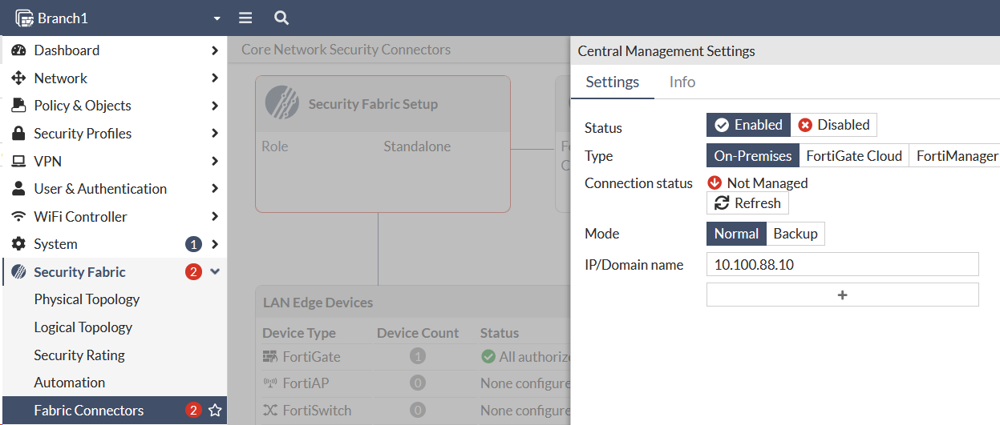
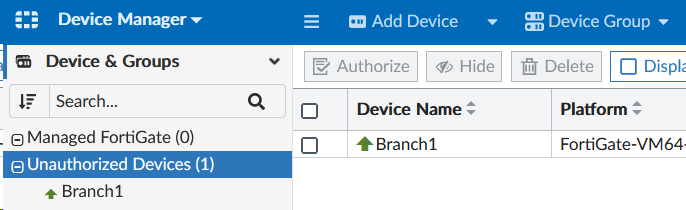
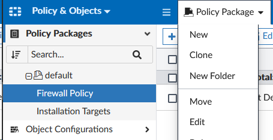
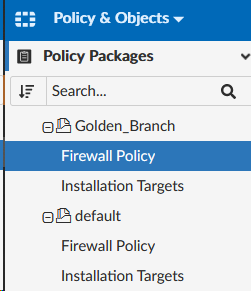
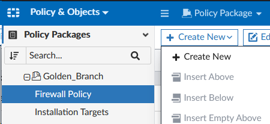
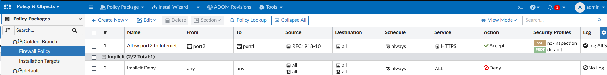

In this section we’ll onboard a FortiGate manually so that it checks into FortiManager. Onboarding a device to FortiManager can be done automatically using various methods (DHCP option, FortiZTP, FortiDeploy SKU), but we’ll do it manually for this lab.

---

{}
Do not Authorize Branch1 during this process. We will do that later.
{}

## Onboard a FortiGate
1. Login to Branch1 using admin/```fortinet```
2. Navigate to **Security Fabric > Fabric Connectors**.
3. Click **Central Management**
    - Click **Enabled**
    - Type ```192.168.0.2``` in the **IP Address** field.
    - Click OK




## Confirm FortiGate is unauthorized in FortiManager
1. Login to FortiManager using admin/```fortinet```
2. Navigate to **Device Manager > Unauthorized Devices**
3. Confirm that the Branch1 FortiGate is listed

{}
Do not Authorize Branch1 here. Our ZTP profile will do this for us.
{}



## Create Policy Package
1. Navigate to **Policy & Objects > Policy Package**
2. Select **Policy Package** and click **New**

3. Type in ```Golden_Branch``` for the **Name** and click **OK** at the bottom of the page.

## Create Policy
1. Select **Policy Packages > Golden_Branch > Firewall Policy**

2. Click **Create New > Create New**  to create a new policy

3. Set the following fields on the _Create New Firewall Policy_ page (leave the rest as default):
    - **Name**: `Allow port2 to Internet`
    - **Incoming Interface**: `port2`
    - **Outgoing Interface**: `port1`
    - **Source**: `RFC1918-10`
    - **Destination**: `all`
    - **Service**: `HTTPS`
    - **Action**: `Accept`
    - **NAT**: `Enable`
    - **Change Note**: `Policy Creation`
4. Click **OK** at the bottom of the page.

You now have your first policy!

