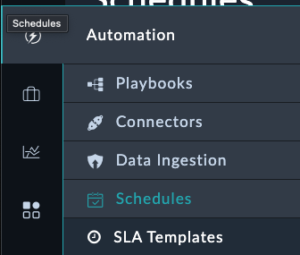

So far there has been a lot of touch! But we're _very_ close to zero now. In this section we'll see how to make the ZTP process truly zero touch.

---

## Modify the ZTP Profile to be Automatic

1. Navigate to **FortiManager > ZTP Profiles** and edit the **Branch ZTP Profile**
2. At the bottom right of the record, click **Edit Record**
3. Change the **Assignment Mode** field from `Manual` to `Automatic`
4. Click **Save**

Now the next time a device is created on FortiSOAR, the profile will be assigned automatically without manual intervention.

---

## Schedule the Device Synchronization

1. Navigate to **Automation > Schedules**
   
   

2. Click **Create New Schedule**

3. Fill out the schedule with the following details:
    - **Name**: `Retrieve Unauthorized Fortigates`
    - **Start Schedule**: `True` (enable the schedule)
    - **Playbook Reference**: `Synch All FMG Device DB Button`
    - **Schedule Frequency**: `Every X minutes`
    - **Interval**: `5` (can be adjusted as low as 1 minute)

4. Click **Save**

This will automatically pull in new unauthorized devices every 5 minutes, eliminating the need for manual synchronization.

---

## Onboard Branch2

1. Login to the Branch2 FortiGate using the web interface
2. Follow the steps outlined [here](/chapter-05-ztp/06-page-onboard-fortigate) to register the FortiGate to FortiManager
3. The device will appear as "Unauthorized" in FortiManager

---

## Watch the Automation in Action

Now you can observe the Branch2 device being automatically:

- **Discovered** by the scheduled synchronization (within 5 minutes)
- **Assigned** the Branch ZTP Profile automatically
- **Configured** with all the settings from your ZTP profile

The entire process should complete without any manual intervention, achieving true zero-touch provisioning.