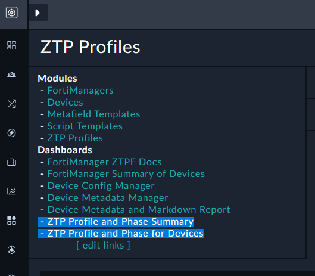
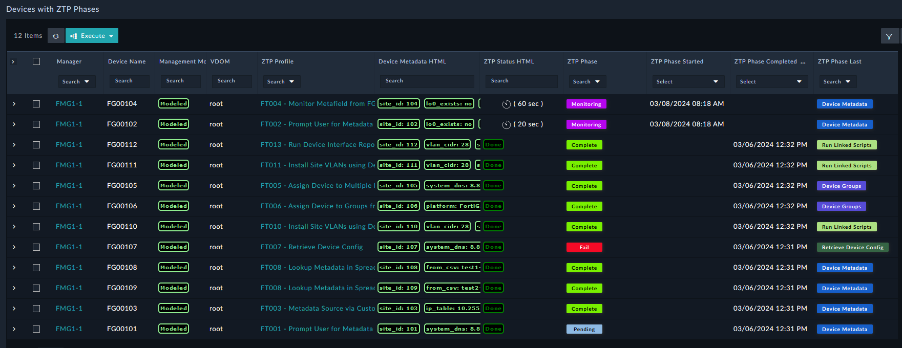
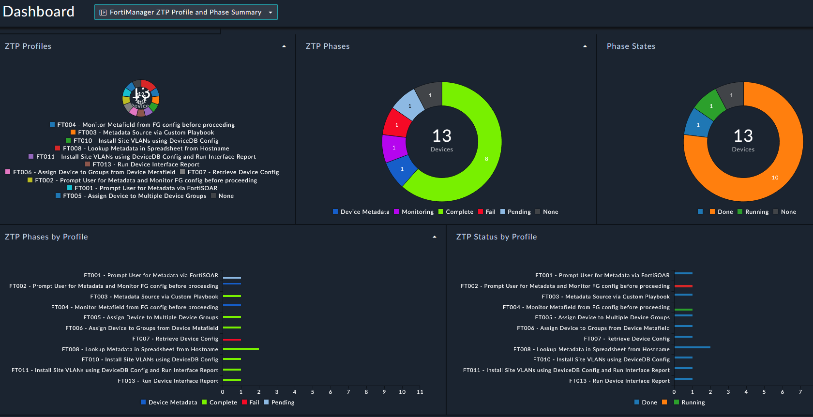
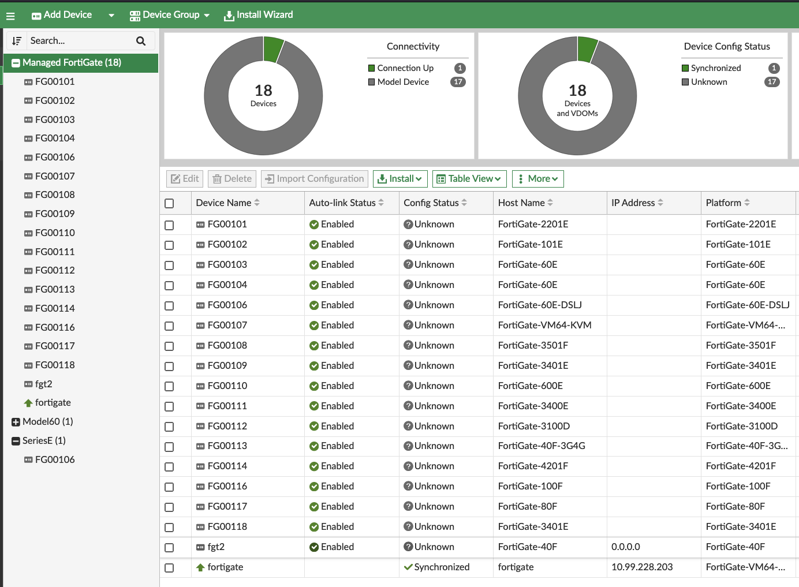

In this chapter, we learned about Zero Touch Provisioning (ZTP) in FortiSOAR. We installed the ZTP Framework, created a ZTP Profile, and ZTP'd a FortiGate. However, we only touched on a fraction of the features and capabilities of the ZTP Framework. To get a glimpse at the full potential we'll install the ZTP Examples Solution Pack.

### Install the ZTP Framework

1. Go to the Content Hub by clicking the **Content Hub** tab in the left pane
2. Search for `FortiManager ZTP Flow - Feature Examples` in the Content Hub

3. Open the Solution Pack and click the **Install** button

### Check out the ZTP Examples

1. Navigate to **Managers > ZTP Profiles** in the left pane
2. Verify that you see the new ZTP Profiles 

{}
The purpose of each ZTP Profile is to demonstrate different features and capabilities of the ZTP Framework.
{}
3. Click on any of the ZTP Profiles to see the details

{}
This profile will: 
- **Authorize** the FortiGate to the FortiManager and then **ZTP** the FortiGate.
- Create a **site_id** variable
- Prompt you to **input** a value for the variable
- Update the variable on the **FortiManager's Device DB**
{}

### Try it out

1. Navigate to **FortiManager > Managers** in the left pane
2. Check the box next to your FortiManager record
3. Click **Execute** and select `Device Model - Create Randomly`

4. Provide `101-118` to the **Range of devices** input field

5. Click **Submit**
6. Locate the ZTP quicklink section at the top left of any FortiManager subpage and click **ZTP Profile and Phase for Devices**

7. Verify that you see the new devices (may take ~30 seconds)

8. Watch as the devices get assigned to the different ZTP profiles
9. You can also see click the **ZTP Profile and Phase Summary** quicklink to see the ZTP phase for each device

{}
Model devices in FortiManager cannot have a Policy Package pushed to them, so not everything in the ZTP flow can be demonstrated here. 
{}

If you check FortiManager, you will also see the model devices in the **Devices & Groups** section. 

