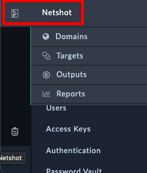

## Install Solution Pack

### Download Solution Pack

Download the Solution Pack file below

{}

### Install Solution Pack

1. Login to FortiSOAR
2. Navigate to the Content Hub
3. Select the **Manage** Tab
4. Click **Upload> Upload Solution Pack**
5. Select the File you downloaded
6. Click **Install**
   
   

7. Click **Confirm**
8. Wait for the SP to finish installing. Should take ~2 minutes

## Add Permissions for the new Modules

1. Navigate to System Settings > Roles
2. Open **Full App Permissions**
3. Click the highlighted **+** icon shown in the picture below.
   
   

4. Click **Save**
5. After clicking Save, you should see a new section appear on the left navigation pane
   
   
   {}
   If you don't see the navigation for Netshot, log out of SOAR and log back in
   {}

## Download Workshop File

Download the Workshop Example file below
{}

## Import Netshot Workshop Settings

1. Navigate to **System Settings > Import Wizard.**
2. Click **Import From File** and import the Solution Pack you downloaded.
3. Select the `FortiSOAR-Export-NetshotWorkshop...` file
   
   {}
   Make sure you see "X Records.." before proceeding. If you see other options, you likely selected the wrong file.
   {}
4. Click **Continue** twice
5. Click **Run Import**
6. Wait around ~1 minute for the import to finish
   
7. Once Complete, navigate to the **Content Hub** and Verify you see NetShot
8. Click **Done**