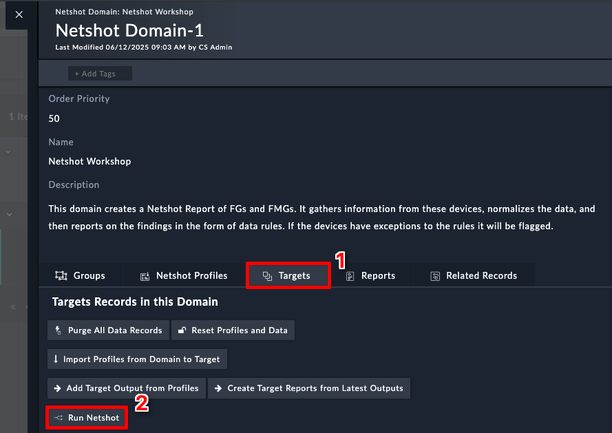

## Update the Fortigate Target

1. Navigate to **Netshot > Targets**
2. Click on **FG1**
3. Click **Edit Record** at the bottom right
4. Update the following fields
    - **Name**: `Branch1`
    - **IP**: `10.100.88.8`
    - **Device Password**: `$3curityFabric`
5. Click **Save**

## Trigger the Domain

1. Navigate to **Netshot > Domains**
2. Open the **Netshot Workshop** domain
3. Select the Targets Tab
4. Click **Run Netshot**
   

## TODO 
Still need to test the above and show results of report