## Update the Fortigate Target

1. Navigate to **Netshot > Targets**
   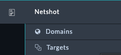
2. Click on **FG1**
   
3. Click **Edit Record** at the bottom right
   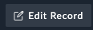
4. Update the following fields
    - **Name**: `Branch1`
    - **IP**: `10.100.88.8`
    - **Device Password**: `$3curityFabric`
      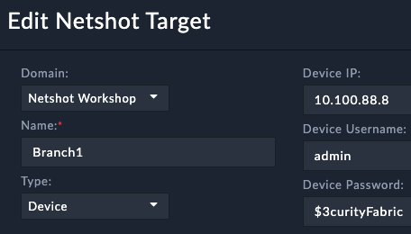
5. Click **Save** at the bottom left

## Trigger Netshot from the device

Click the tab **Netshot Data**, then click the button **Run Netshot**
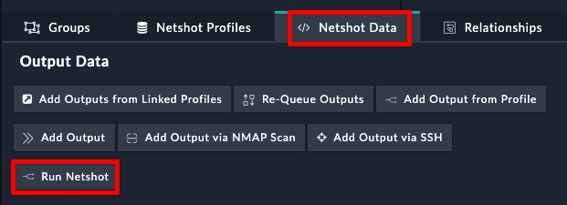

You will notice that the **Netshot Status** indicator shows _Running_
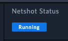

You will also notice which data queries are complete or waiting
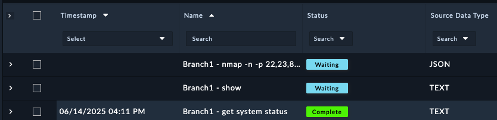

Once netshot completes, you should see a total score that the device earned from the various audits performed. The audit scores come from the profiles that were assigned to the device.

### Investigate the Results

1. Click on the row under netshot data called **get system status**
2. Click on the **Source Data** tab, and expand the **Normalized Data**
   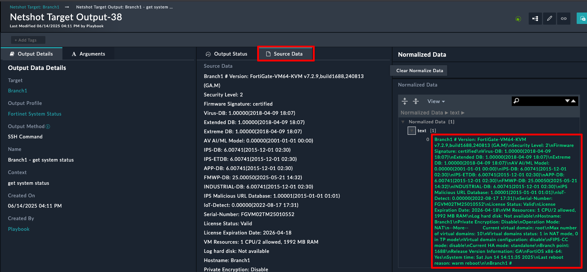
   Source data is the raw data from the query, and normalized data is what the raw data was transformed into. In this case, the data wasn't modified or cleaned in any way
3. Scroll down and to the **Output Data Reports** and click **License is Valid**
   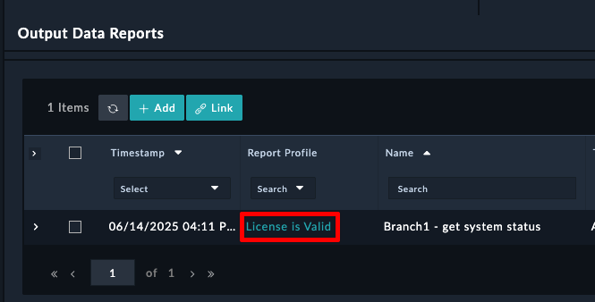

Notice the settings here. This report is saying that the text field from the normalized data must contain a regex of `License Status(\s+)?: Valid` . If that **Regex Pattern Exists**, then the report gives out 25 points
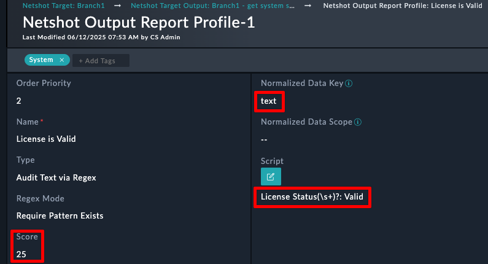

## Understand Domains

Domains allow you to create a grouping of devices that needed audited.

1. Navigate to **Netshot > Domains**
2. Open the **Netshot Workshop** domain
3. Select the Targets Tab

Notice that the domain consists of 2 Fortigates and 1 Fortimanager

## Understand Reports

1. Navigate to the **Reports** Module
    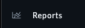
2. Click **View** on the **Netshot Report Domain**
    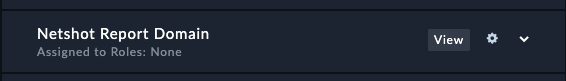
3. Select the **Netshot Workshop** Domain for the Report Input
    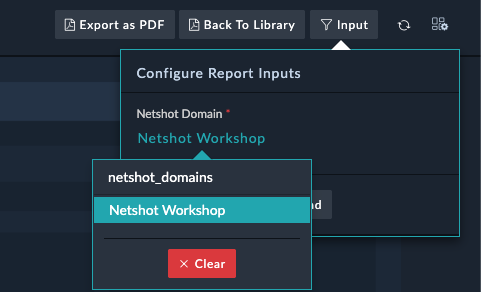
4. Click **OK**

Check out the report, There were some exceptions found from the FMG because it did not meet the specified 7.6 version
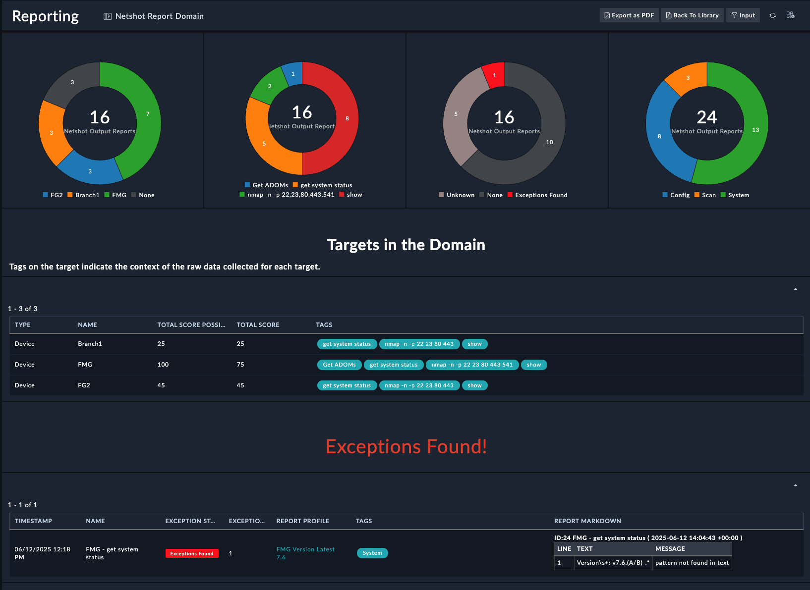