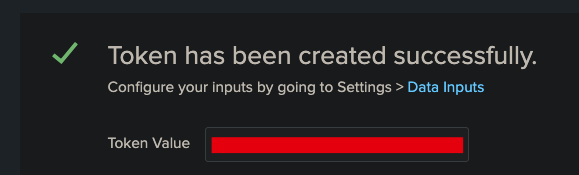

## Overview

The Splunk connector in FortiSOAR enables powerful SIEM integration capabilities, allowing you to run ad-hoc queries using Splunk Query Language (SPL) and automatically trigger playbooks based on search results. This integration transforms raw log data into actionable security intelligence.

### What You'll Learn

- Configure Splunk HTTP Event Collector for log ingestion
- Set up FortiSOAR-Splunk connector authentication
- Create automated alert generation from Splunk searches
- Build playbooks that respond to Splunk findings

### Prerequisites

- FortiSOAR instance with admin access
- Splunk Enterprise or Cloud instance (Cloud Instance trial does not have API access enabled)
- Basic understanding of Splunk Query Language (SPL)
- Network connectivity between FortiSOAR and Splunk

---

## Lab Environment Setup

### Option 1: Splunk Enterprise on AWS (Recommended for Testing)

For this guide, we'll use a Splunk Enterprise trial on AWS, which provides:

- **Cost**: Free trial for 60 days (AWS infrastructure costs only)
- **Features**: Full Enterprise capabilities
- **Scalability**: Easily adjustable instance sizes
- **Access**: Complete administrative control

#### Quick AWS Deployment

1. **Launch Splunk from AWS Marketplace**
    - Search for "Splunk Enterprise" in AWS Marketplace
    - Select appropriate instance size (t3.medium minimum recommended)
    - Configure security groups to allow ports 8000 (Web UI) and 8088 (HEC)

2. **Initial Access**
    - Default credentials: `admin` / `<instance-id>`
    - Change password on first login
    - Complete the initial setup wizard

---

## Part 1: Configure Splunk Data Ingestion

### Step 1: Enable HTTP Event Collector (HEC)

The HTTP Event Collector allows external systems to send data directly to Splunk via REST API.

1. **Navigate to Data Inputs**
   ```
   Settings → Data Inputs → HTTP Event Collector
   ```
   

2. **Add New Token**
   

3. **Configure Token Settings**
    - **Name**: `FortiSOAR-Integration`
    - **Description**: `Token for HTTP log ingestion and queries`
      

4. **Set Input Settings**
    - **Source Type**: `fortinet:firewall` (for FortiGate logs)
    - **Index**: `main`
      

5. **Review and Create**
    - Verify all settings
    - Click **Review** → **Submit**
    - **Save the token**: You'll need this for API log uploads
      

### Step 3: Test HEC Connectivity

Verify your HEC setup with a simple test:

```bash
curl -k "https://<splunk-server>:8088/services/collector" \
-H "Authorization: Splunk <your-hec-token>" \
-d '{"event": "Test event from FortiSOAR setup", "source": "fortisoar_test"}'
```

Expected response:

```json
{
  "text": "Success",
  "code": 0
}
```

---

## Part 2: Configure FortiSOAR Splunk Connector

### Step 1: Install Splunk Connector

1. **Navigate to Connectors**
   ```
   Automation → Connectors → Manage
   ```

2. **Search and Install**
    - Search for "Splunk"
    - Click **Install** on the official Splunk connector
    - Wait for installation to complete

### Step 2: Create Splunk Configuration

1. **Connector Settings**
   ```
   Configuration Name: Splunk-Production
   Server URL: https://your-splunk-server:8089
   Username: your-splunk-username
   Password: your-splunk-password
   Protocol: https
   Splunk API Port: 8089
   Verify SSL: False (unchecked)
   ```
   

2. Click **Save**, and verify you the Health Check passes

---

## Part 3: Generate Sample Logs

{}
You can skip this step if you already have logs in Splunk
{}

Create a Python script to continuously feed FortiGate logs to Splunk:

{}
This python could be ran directly from the Code snippet step in fortisoar
{}

### Enhanced Log Forwarder Script

```python
#!/usr/bin/env python3
"""
FortiGate to Splunk Log Forwarder
Reads FortiGate logs and forwards them to Splunk HEC
"""

import random
import requests
from datetime import datetime

# Configuration
SPLUNK_HEC_URL = "https://your-splunk-server:8088/services/collector"
SPLUNK_HEC_TOKEN = "your-hec-token-here"

# Device names (simulate 5 FortiGate firewalls)
devices = [f"FG100F-{i:03d}" for i in range(1, 6)]

# Sample BPDU event template
log_template = (
    '<134>date={date} time={time} devname="{devname}" devid="{devid}" '
    'eventtime={eventtime} tz="+0000" logid="0419016384" type="event" '
    'subtype="system" level="alert" vd="root" logdesc="BPDU packet received" '
    'msg="BPDU packet received on {port}, shutting down the port."'
)

# Generate 20 logs
for _ in range(20):
    now = datetime.utcnow()
    devname = random.choice(devices)
    devid = f"{devname}-SN{random.randint(100000, 999999)}"
    port = f"port{random.randint(1, 5)}"

    log = log_template.format(
        date=now.strftime("%Y-%m-%d"),
        time=now.strftime("%H:%M:%S"),
        devname=devname,
        devid=devid,
        eventtime=int(now.timestamp() * 1_000_000),
        port=port
    )
    print(log)

    payload = {
        "event": log,
        "sourcetype": "fortinet:firewall"
    }

    response = requests.post(
        SPLUNK_HEC_URL,
        headers={"Authorization": f"Splunk {SPLUNK_HEC_TOKEN}"},
        json=payload,
        verify=False  # Set to True if you have proper TLS setup
    )

    if response.status_code != 200:
        print(f"Error: {response.status_code} - {response.text}")
    else:
        print(f"Sent log from {devname}")

```

{}
Make sure to update your server url and API token in the code snippet to match your environment
{}

## Verify logs in splunk

After running the script, lets check that we see logs in Splunk

1. Navigate to **Search and Reporting**
2. Search for `sourcetype="fortinet:firewall"`
   

## Query Splunk from FortiSOAR

1. Create a new playbook. Name it `BPDU Splunk Query` for easy searching later
2. You can use the **Referenced** Start step for testing
3. Drag a new step from the Start, and select **Connector**
4. Select **Splunk**
    - Add a name like `Query BPDU Packets`
    - Select the **Action** _Invoke Search_
    - Use this query for the search
   
   ```text
    index=main sourcetype=fortinet:firewall "BPDU packet received"
    | bin _time span=1m
    | stats count as bpdu_count by devname, _time
    | where bpdu_count > 3
    | stats sum(bpdu_count) as total_bpdu_events by devname
   ```
    - Delete the text inside the **Earliest Time** Field. The default time won't work with the query. Your configuration should look like the image below.
      
5. Save the step
6. Save and run the playbook.

7. Check the playbook results. If your query worked you will see output like this
   

## Create a Schedule to automate running this playbook

1. Navigate to Automation > Schedules
2. Click **Create New Schedule** at the top right
    - Name `Trigger Splunk Query`
    - **Start Schedule** : Enabled (True)
    - **Playbook Reference**: _Search for you playbook name_ `BPDU packet received`
    - Select **Schedule Frequency**: _Hourly_
3. Click Save
    