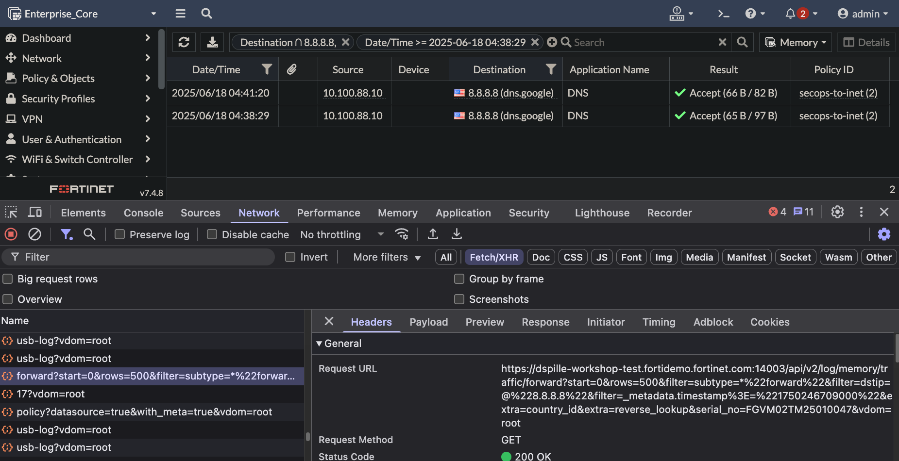

### Identify traffic log filter.

Using the browser network debug to identify the syntax of the filter


```text
/api/v2/log/memory/traffic/forward?start=0&rows=500&filter=subtype=*%22forward%22&filter=dstip=@%228.8.8.8%22&filter=_metadata.timestamp%3E=%221750246709000%22
```

Translated to FMG sys/proxy/json, the data looks like this. Notice the placeholders I've left in for dstip and epoch timestamp

- URL: `/sys/proxy/json`
- Method: Exec
- data:

```json
{
  "action": "get",
  "resource": "/api/v2/log/memory/traffic/forward?start=0&rows=100&filter=subtype=*%22forward%22&filter=dstip=@%22{{dstip}}%22&filter=_metadata.timestamp%3E=%22{{timestamp}}%22",
  "target": [
    "adom/root/device/Enterprise_Core"
  ]
}

```