## Lab Overview

**What You'll Learn:**

- Prepare FortiManager with a policy package and database script
- Configure FortiSOAR with the ZTP Solution Pack and connector
- Trigger and monitor a playbook that automatically creates firewall policies

**Tested Versions:** FortiManager 7.6.5 · FortiSOAR 7.6.5 · ZTP Solution Pack 1.0.

---

## How It Works

This automation demonstrates how FortiSOAR creates firewall policies on FortiManager from structured request records. The flow is:

1. A **Policy Package** is prepared in FortiManager
2. FortiSOAR imports the automation playbook
3. A **Policy Request record** triggers the playbook
4. FortiSOAR connects to FortiManager via API and **creates the requested policy**
5. FortiSOAR prompts the user to confirm the policy push to the FortiGate

---

## Part 1: FortiManager Setup

### Task 1.1: Create a Policy Package

1. Log into **FortiManager**
2. Navigate to **Policy & Objects → Policy Packages**
   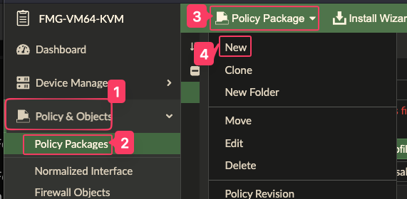

3. Click **Policy Package > New** and name it `Automation_Package`.
   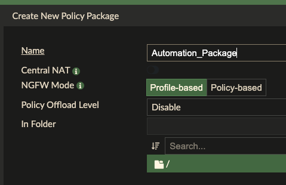

4. Click **OK** to create the package.
   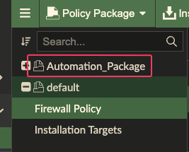
5. Assign an installation target to the package so we can test installing it later on. 

### Task 1.2: Create and Run a Database Script

The script initializes the policy table inside the package.

1. Navigate to **Device Manager → Scripts**
2. Click **Create New > Script**
   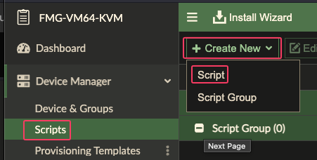
4. Name it `Create_Automation_Policies`, with _Run script on_ as **Policy Package or ADOM Database**, and with this content:

```cli
config firewall service custom
    edit "HTTP"
        set protocol "TCP/UDP/SCTP"
        set tcp-portrange 80
        set comment "HTTP"
    next
    edit "HTTPS"
        set protocol "TCP/UDP/SCTP"
        set tcp-portrange 443
        set comment "HTTPS"
    next
    edit "DNS"
        set udp-portrange 53
        set comment "DNS"
    next
    edit "MySQL"
        set tcp-portrange 3306
        set comment "MySQL"
    next
    edit "SSH"
        set tcp-portrange 22
        set comment "SSH"
    next
    edit "LPD"
        set tcp-portrange 515
        set comment "LPD"
    next
    edit "IPP"
        set tcp-portrange 631
        set comment "IPP"
    next
        edit "IPSEC"
        set tcp-portrange 4500
        set comment "IPSEC"
    next
end
config firewall address
    edit Server001
        set type ipmask
        set subnet 192.168.0.10 255.255.255.255
    next
    edit PrinterOffice
        set type iprange
        set start-ip 10.0.2.50
        set end-ip 10.0.2.55
    next
    edit Users_Subnet
        set type iprange
        set start-ip 172.16.1.0
        set end-ip 172.16.1.255
    next
    edit PartnerNetworks
        set type fqdn
        set fqdn partners.example.net
    next
    edit VPN_Gateway
        set type ipmask
        set subnet 203.0.113.100 255.255.255.255
    next
    edit DMZ_Host001
        set type ipmask
        set subnet 192.168.50.100 255.255.255.255
    next
    edit IoT_Device001
        set type ipmask
        set subnet 10.10.5.20 255.255.255.255
    next
    edit Guest_Wireless
        set type ipmask
        set subnet 192.168.20.0 255.255.255.0
    next
    edit DatabaseServer
        set type ipmask
        set subnet 10.20.30.40 255.255.255.255
    next
    edit VoIP_Phone001
        set type ipmask
        set subnet 172.16.5.100 255.255.255.255
    next
    edit WebProxy
        set type iprange
        set start-ip 10.1.1.10
        set end-ip 10.1.1.20
    next
    edit Management_Server
        set type ipmask
        set subnet 192.168.100.200 255.255.255.255
    next
    edit IoT_Controller
        set type ipmask
        set subnet 10.10.5.10 255.255.255.255
    next
    edit Marketing_Department
        set type ipmask
        set subnet 172.16.20.0 255.255.255.0
    next
    edit Mail_Server
        set type ipmask
        set subnet 192.168.0.30 255.255.255.255
    next
    edit Video_Conference
        set type ipmask
        set subnet 10.50.100.150 255.255.255.255
    next
    edit PrintServer
        set type ipmask
        set subnet 192.168.0.55 255.255.255.255
    next
    edit Backup_Server
        set type ipmask
        set subnet 10.5.5.100 255.255.255.255
    next
    edit Engineering_Subnet
        set type ipmask
        set subnet 172.16.30.0 255.255.255.0
    next
    edit DNS_Server
        set type ipmask
        set subnet 192.168.0.5 255.255.255.255
    next
end
config firewall policy
    edit 1
        set srcintf internal
        set dstintf wan
        set srcaddr Users_Subnet
        set dstaddr all
        set action accept
        set schedule always
        set service ALL
        set logtraffic all
    next
    edit 2
        set srcintf internal
        set dstintf dmz
        set srcaddr Users_Subnet
        set dstaddr Server001
        set action accept
        set schedule always
        set service HTTP HTTPS
        set logtraffic all
    next
    edit 3
        set srcintf internal
        set dstintf port4
        set srcaddr Users_Subnet
        set dstaddr VPN_Gateway
        set action accept
        set schedule always
        set service IPSEC
        set logtraffic all
    next
    edit 4
        set srcintf dmz
        set dstintf internal
        set srcaddr Server001
        set dstaddr Users_Subnet
        set action accept
        set schedule always
        set service ALL
        set logtraffic all
    next
    edit 5
        set srcintf dmz
        set dstintf wan
        set srcaddr Server001
        set dstaddr all
        set action deny
        set schedule always
        set service ALL
        set logtraffic all
    next
    edit 6
        set srcintf internal
        set dstintf port4
        set srcaddr IoT_Device001
        set dstaddr all
        set action accept
        set schedule always
        set service DNS HTTP HTTPS
        set logtraffic all
    next
    edit 7
        set srcintf internal
        set dstintf internal
        set srcaddr Users_Subnet
        set dstaddr Guest_Wireless
        set action accept
        set schedule always
        set service HTTP HTTPS
        set logtraffic all
    next
    edit 8
        set srcintf internal
        set dstintf internal
        set srcaddr Guest_Wireless
        set dstaddr Users_Subnet
        set action accept
        set schedule always
        set service HTTP HTTPS
        set logtraffic all
    next
    edit 9
        set srcintf internal
        set dstintf dmz
        set srcaddr Marketing_Department
        set dstaddr Server001
        set action accept
        set schedule always
        set service HTTP HTTPS
        set logtraffic all
    next
    edit 10
        set srcintf internal
        set dstintf dmz
        set srcaddr Marketing_Department
        set dstaddr Server001
        set action accept
        set schedule always
        set service HTTP HTTPS
        set logtraffic all
    next
    edit 11
        set srcintf internal
        set dstintf wan
        set srcaddr Engineering_Subnet
        set dstaddr all
        set action accept
        set schedule always
        set service ALL
        set logtraffic all
    next
    edit 12
        set srcintf internal
        set dstintf dmz
        set srcaddr Engineering_Subnet
        set dstaddr Server001
        set action accept
        set schedule always
        set service SSH
        set logtraffic all
    next
    edit 13
        set srcintf dmz
        set dstintf internal
        set srcaddr Server001
        set dstaddr Engineering_Subnet
        set action accept
        set schedule always
        set service SSH
        set logtraffic all
    next
    edit 14
        set srcintf internal
        set dstintf wan
        set srcaddr DMZ_Host001
        set dstaddr all
        set action accept
        set schedule always
        set service HTTP HTTPS
        set logtraffic all
    next
    edit 15
        set srcintf internal
        set dstintf dmz
        set srcaddr DMZ_Host001
        set dstaddr Server001
        set action accept
        set schedule always
        set service HTTP HTTPS
        set logtraffic all
    next
    edit 16
        set srcintf internal
        set dstintf wan
        set srcaddr DatabaseServer
        set dstaddr all
        set action deny
        set schedule always
        set service ALL
        set logtraffic all
    next
    edit 17
        set srcintf internal
        set dstintf port4
        set srcaddr DatabaseServer
        set dstaddr all
        set action accept
        set schedule always
        set service MySQL
        set logtraffic all
    next
    edit 18
        set srcintf dmz
        set dstintf internal
        set srcaddr Server001
        set dstaddr Users_Subnet
        set action accept
        set schedule always
        set service HTTP HTTPS
        set logtraffic all
    next
    edit 19
        set srcintf internal
        set dstintf wan
        set srcaddr PrintServer
        set dstaddr all
        set action accept
        set schedule always
        set service LPD
        set logtraffic all
    next
    edit 20
        set srcintf internal
        set dstintf dmz
        set srcaddr PrintServer
        set dstaddr Server001
        set action accept
        set schedule always
        set service IPP
        set logtraffic all
    next
end
```

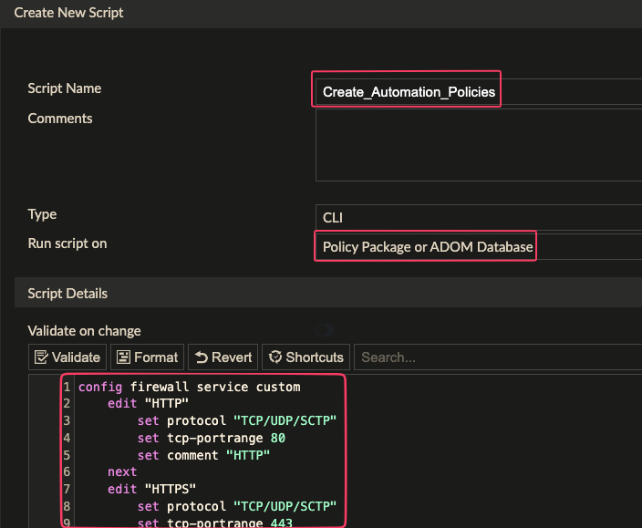

3. Click **OK** to save the script.
4. Fill in a change note if prompted
   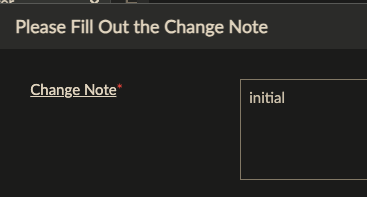
3. Select the script and click **Run Script**.
   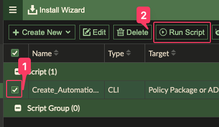
4. Select the **Automation_Package** and click **Run Now**
   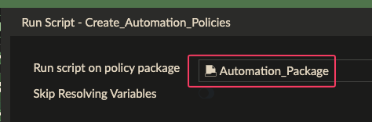

**Expected Result:** The script executes successfully and a policy table exists in the package.
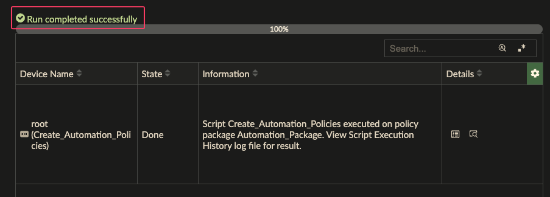

### Task 1.3: Record Required Values

Note these values — you'll need them when configuring FortiSOAR:

| Value               | Your Entry           |
|---------------------|----------------------|
| ADOM Name           |                      |
| Policy Package Name | `Automation_Package` |

---

## Part 2: FortiSOAR Setup

### Task 2.1: Install the ZTP Solution Pack

{}
The ZTP Solution Pack **must be installed before** importing the automation package.
{}

1. Login to **FortiSOAR** as **csadmin**
1. Navigate to **Content Hub → Solution Packs**
2. Confirm that **FortiManager ZTP Flow** Solution Pack is Installed
   

If you do not see the Solution Pack installed, Open the Pack and click **Install**.

### Task 2.3: Enable Custom Connectors

1. In the **System Settings** menu, click **Advanced Developer Settings** and enable the **Custom Connectors** feature.
   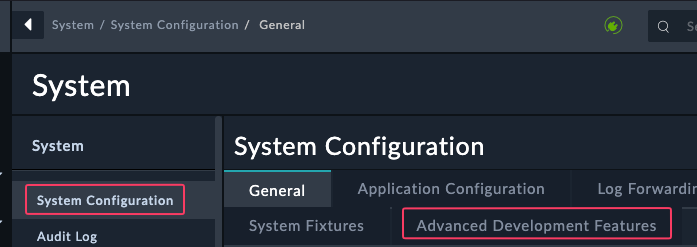
2. Click the checkbox under **Build your own connector**
   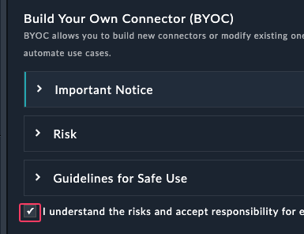
3. Click **Submit**

### Task 2.4: Import the Automation Package

1. Download the **FortiSOAR Policy Request Automation Export-202603050614.zip** file from this repository
   {}
2. Navigate to **System Settings → Import Wizard**
3. Click **Import from File**
   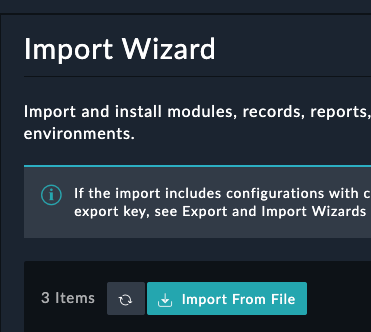
   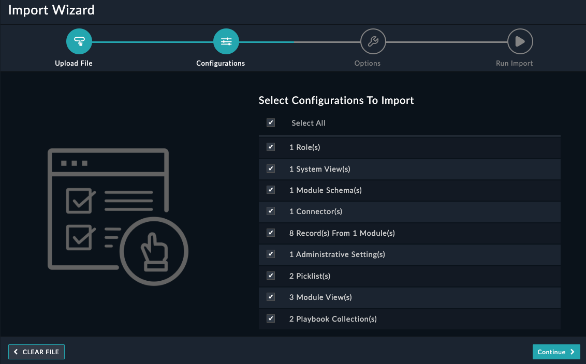

4. Upload the `.zip` export file from this repository
5. Click **Continue**
   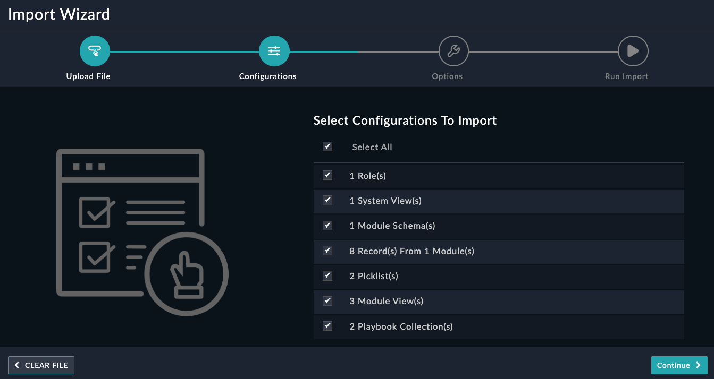
6. Click **0 Connectors** and click **Import All**
   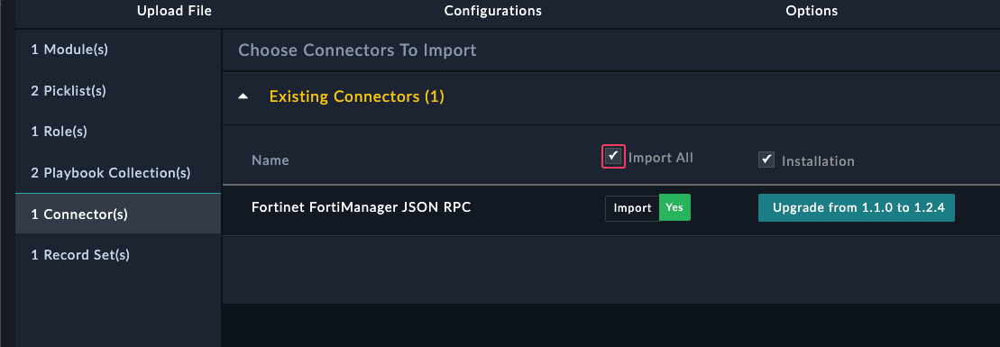
7. Click **Continue**
8. Click **Run Import**
9. Click **I have reviewed the changes - Publish**
9. Wait for the import to complete
   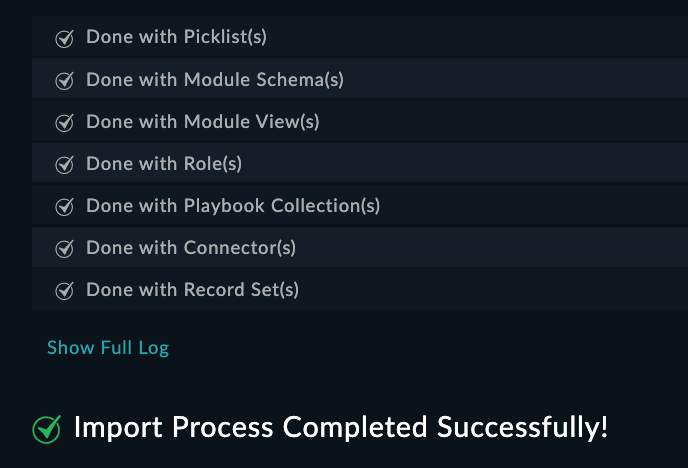

### Task 2.5: Configure the Connector

1. Download the custom fortimanager connector here
   {}

1. Open the **Content Hub > Manage** tab and click **Upload > Upload Connector**
   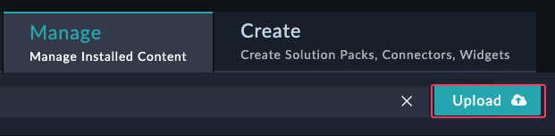
   {}
   Do not upload the connector without first checking the box to **Replace existing version**
   {}
2. Click **Replace existing version**
   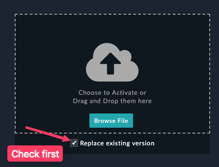
3. Upload the connector file you downloaded
   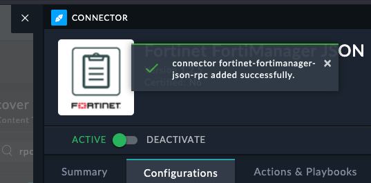
4. Exit the connector

### Task 2.2: Create a FortiManager Manager Record

1. Using the left navigation menu, browse to **FortiManger → Managers**
   
2. Confirm you see an entry in the table for a ForitManager record
   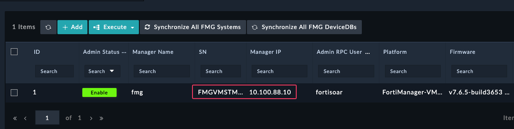

#### If you do not see an entry:

1. Create a new **FortiManager Manager** entry by clicking **+Add**
2. Fill in a manager-name and click **Save**
   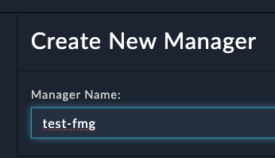
3. You should get a prompt to fill in the Device Details and click **Continue**
   
3. Note the **Manager Name** since it will be referenced by the connector

### Create a connector config

1. Open the Manager Record
2. Click **Execute > Create Connector Configuration**
   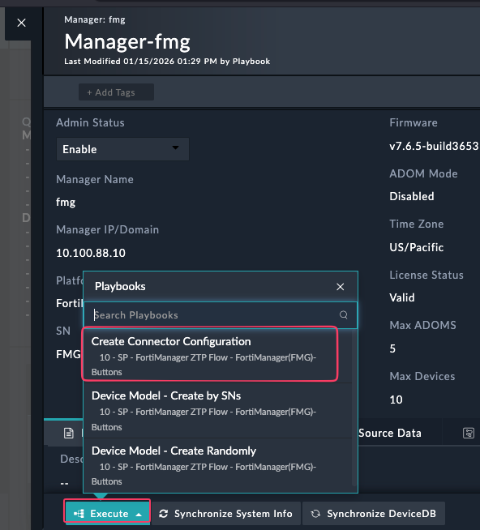
3. Type in the password for your fortmanger. In the FNDN lab it is `fortinet`. Click Continue
   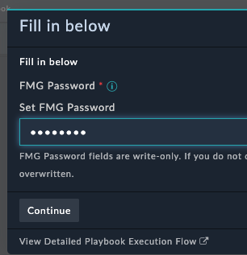
4. Go back to the Content Hub and confirm you see a config in your fortimanager json rpc connector
5. Make sure to mark the config as default by clicking the checkbox. Save the config
   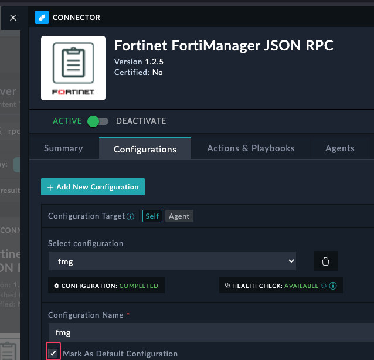

---

## Part 3: Running the Automation

### Task 3.1: Configure a Policy Request

1. Navigate to the Policy Requests module, it should be at the bottom of the left navigation menu. You may have to scroll on the navigation menu to find it.
   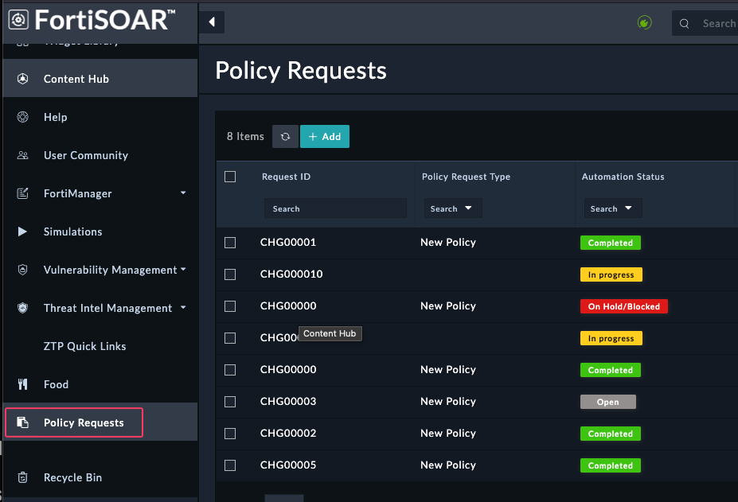
1. Open the `CHG00001` record in the **Policy Requests** module
2. Update the following fields:

| Field          | Value                                 |
|----------------|---------------------------------------|
| FortiManager   | Select the Manager record you created |
| ADOM           | Enter your ADOM name                  |
| Policy Package | `Automation_Package`                  |

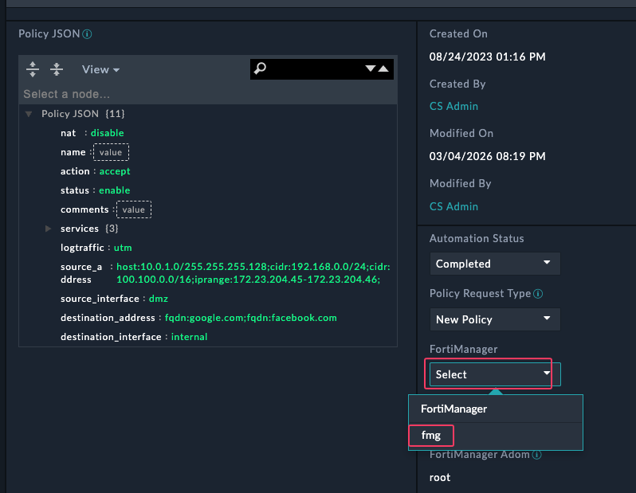

### Task 3.2: Execute and Monitor the Playbook

1. Click **Execute → Create Policy from Request** and follow any prompts
2. Navigate to **Automation → Playbook Execution** to monitor progress
    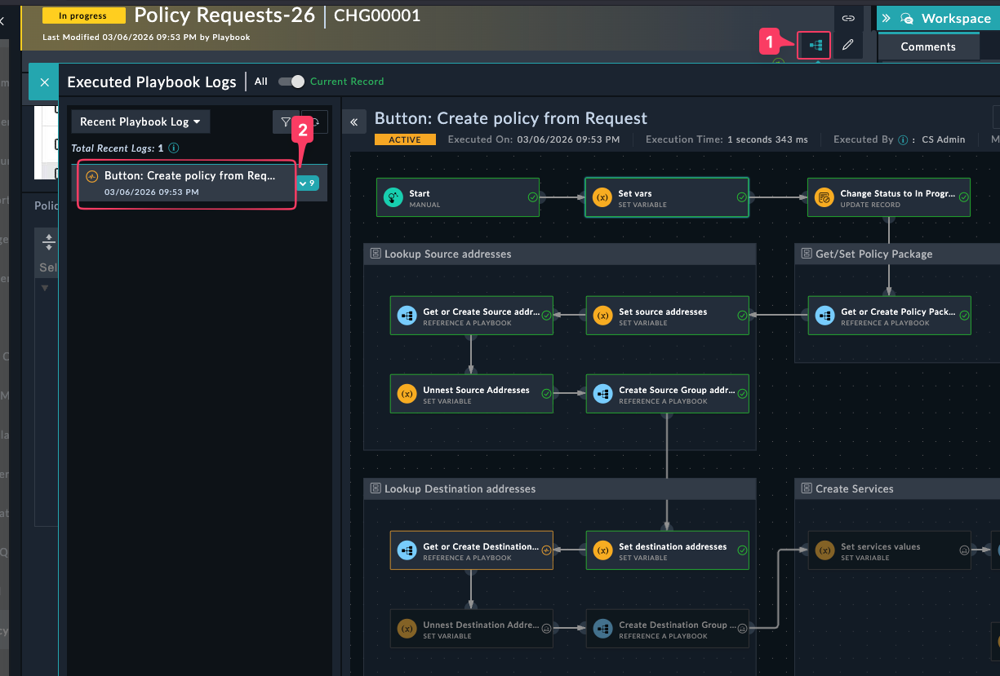
3. Once the playbook adds the policy, you will get a popup asking if you want to install the policy to the device based on the installation targets. 
   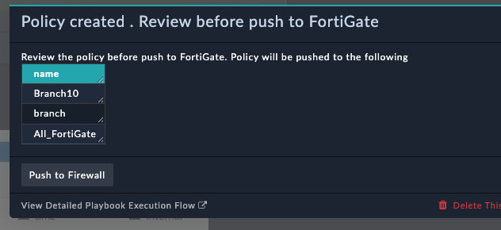
4. Click **Push to firewall**

You have now successfully configured FortiSOAR to automate policy creation and installation.